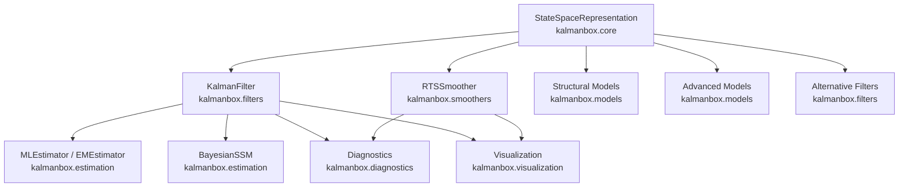

# API Reference

Complete reference for all public classes, functions, and modules in
`kalmanbox`. Pages document constructor parameters, method signatures,
return types, and usage examples for the full public API.

---

## Module Overview

kalmanbox is the **foundational layer** of the NodesEcon ecosystem.
Every class ultimately accepts or produces a
[`StateSpaceRepresentation`](core.md#statespacerepresentation) and
filters through it via a [`KalmanFilter`](core.md#kalmanfilter) or one
of its nonlinear / numerically-specialised variants in
[Alternative Filters](filters.md).

---

## API Conventions

### Naming

| Convention | Example |
|---|---|
| Classes | `KalmanFilter`, `BasicStructuralModel` |
| Methods | `.filter()`, `.smooth()`, `.fit()` |
| Result containers | `FilterResult`, `SmoothResult`, `ForecastResult` |
| Module paths | `kalmanbox.filters.kalman.KalmanFilter` |

### State-Space Notation

kalmanbox adopts the Durbin & Koopman (2012) notation throughout:

$$
y_t = Z_t\, a_t + d_t + \varepsilon_t, \quad \varepsilon_t \sim \mathcal{N}(0, H_t)
$$

$$
a_{t+1} = T_t\, a_t + c_t + R_t\, \eta_t, \quad \eta_t \sim \mathcal{N}(0, Q_t)
$$

| Symbol | Shape | Description |
|---|---|---|
| `y_t` | `(p,)` | Observation vector |
| `a_t` | `(m,)` | State vector |
| `Z` | `(p, m)` | Observation (design) matrix |
| `T` | `(m, m)` | State transition matrix |
| `R` | `(m, r)` | Noise selection (loading) matrix |
| `H` | `(p, p)` | Observation noise covariance |
| `Q` | `(r, r)` | State noise covariance |
| `d` | `(p,)` | Observation intercept |
| `c` | `(m,)` | State intercept |
| `p` | — | Number of observed variables |
| `m` | — | State dimension |
| `r` | — | State disturbance dimension (`r ≤ m`) |
| `n` | — | Number of time steps |

### Observation Input

| Shape | Interpretation |
|---|---|
| `(n,)` | Univariate series (`p = 1`) |
| `(n, 1)` | Univariate series, column form |
| `(n, p)` | Multivariate series (`p > 1`) |

Missing observations are encoded as `np.nan`. The `missing_obs_method`
parameter on `KalmanFilter` controls whether missing steps are **skipped**
(exact diffuse) or **imputed** via the filter density.

### Standard Return Types

| Method | Return Type | Key attributes |
|---|---|---|
| `.filter(y)` | `FilterResult` | `a_filt`, `P_filt`, `v`, `F`, `K`, `loglikelihood` |
| `.smooth(filter_result)` | `SmoothResult` | `a_smooth`, `P_smooth`, `V_smooth` |
| `.predict(n_ahead, result)` | `ForecastResult` | `forecast`, `lower`, `upper` |
| `.fit(y)` | `FitResult` | `params`, `loglikelihood`, `aic`, `bic`, `converged` |
| `.loglikelihood(y)` | `float` | Scalar prediction-error-decomposition log-likelihood |
| `.disturbance_smooth(result)` | `DisturbanceResult` | `eta_smooth`, `eps_smooth` |

---

-   :material-cube-outline:{ .lg .middle } **Core**

    ---

    `StateSpaceRepresentation`, `KalmanFilter`, `RTSSmoother`, and the
    result containers shared across all models.

    [:octicons-arrow-right-24: core](core.md)

-   :material-chart-timeline-variant:{ .lg .middle } **Structural Models**

    ---

    `LocalLevel`, `LocalLinearTrend`, `BasicStructuralModel`,
    `UnobservedComponents`, `Cycle` — ready-to-use structural model classes.

    [:octicons-arrow-right-24: structural](structural.md)

-   :material-tune:{ .lg .middle } **Advanced Models**

    ---

    `DynamicFactorModel`, `TimeVaryingParameters`, `EMEstimator` — for
    factor models, time-varying regression, and EM estimation.

    [:octicons-arrow-right-24: advanced](advanced.md)

-   :material-filter:{ .lg .middle } **Alternative Filters**

    ---

    `ExtendedKalmanFilter`, `UnscentedKalmanFilter`, `SquareRootFilter`,
    `InformationFilter`, `EnsembleKalmanFilter`.

    [:octicons-arrow-right-24: filters](filters.md)

-   :material-arrow-collapse-left:{ .lg .middle } **Smoothers**

    ---

    `RTSSmoother`, `FixedIntervalSmoother`, `FixedLagSmoother`,
    `DisturbanceSmoother`.

    [:octicons-arrow-right-24: smoothers](smoothers.md)

-   :material-tune:{ .lg .middle } **Estimation**

    ---

    `MLEstimator`, `BayesianSSM`, `InverseGamma`, `EMEstimator` and
    related optimisation utilities.

    [:octicons-arrow-right-24: estimation](estimation.md)

-   :material-stethoscope:{ .lg .middle } **Diagnostics**

    ---

    Residual analysis, statistical tests, and MCMC convergence
    diagnostics.

    [:octicons-arrow-right-24: diagnostics](diagnostics.md)

-   :material-chart-scatter-plot:{ .lg .middle } **Visualization**

    ---

    Filter/smoother state plots, component decomposition, forecast fan
    charts, diagnostic figures, themes, and export helpers.

    [:octicons-arrow-right-24: visualization](visualization.md)

-   :material-file-chart:{ .lg .middle } **Reports**

    ---

    `ReportManager` and HTML / LaTeX / Markdown exporters for
    publication-ready model summaries.

    [:octicons-arrow-right-24: reports](reports.md)

-   :material-database:{ .lg .middle } **Datasets**

    ---

    `load_dataset`, `list_datasets`, `dataset_info` — built-in time
    series for examples and benchmarks.

    [:octicons-arrow-right-24: datasets](datasets.md)

-   :material-dice-3:{ .lg .middle } **Simulation**

    ---

    `simulate_ssm` and `bootstrap_filter` for forward simulation and
    particle-based state estimation.

    [:octicons-arrow-right-24: simulation](simulation.md)

-   :material-flask:{ .lg .middle } **Experiment**

    ---

    `ExperimentTracker` and helpers for logging, reproducibility, and
    model comparison workflows.

    [:octicons-arrow-right-24: experiment](experiment.md)

-   :material-wrench:{ .lg .middle } **Utilities**

    ---

    Matrix operations, data transforms, and optional Numba-accelerated
    kernels.

    [:octicons-arrow-right-24: utils](utils.md)

-   :material-console:{ .lg .middle } **CLI**

    ---

    The `kalmanbox` command-line interface for fitting, forecasting, and
    report generation without writing Python.

    [:octicons-arrow-right-24: cli](cli.md)

---

## Quick Reference

### Core & Filters

| Class / Function | Module | Description |
|---|---|---|
| [`StateSpaceRepresentation`](core.md#statespacerepresentation) | `kalmanbox.core` | State-space system matrices (Z, T, R, H, Q) |
| [`KalmanBoxConfig`](core.md#kalmanboxconfig) | `kalmanbox.core` | Global library configuration |
| [`KalmanFilter`](core.md#kalmanfilter) | `kalmanbox.filters` | Linear Gaussian Kalman filter |
| [`RTSSmoother`](core.md#rtssmoother) | `kalmanbox.smoothers` | Rauch–Tung–Striebel backward smoother |
| [`FixedIntervalSmoother`](smoothers.md#fixedintervalsmoother) | `kalmanbox.smoothers` | de Jong information-filter smoother |
| [`FixedLagSmoother`](smoothers.md#fixedlagsmoother) | `kalmanbox.smoothers` | Online rolling-window smoother |
| [`DisturbanceSmoother`](smoothers.md#disturbancesmoother) | `kalmanbox.smoothers` | Disturbance / signal-extraction smoother |

### Structural Models

| Class | Module | Description |
|---|---|---|
| [`LocalLevel`](structural.md#locallevel) | `kalmanbox.models` | Random walk + observation noise |
| [`LocalLinearTrend`](structural.md#locallineartrend) | `kalmanbox.models` | Stochastic level + slope |
| [`BasicStructuralModel`](structural.md#basicstructuralmodel) | `kalmanbox.models` | Trend + seasonal + cycle + irregular |
| [`UnobservedComponents`](structural.md#unobservedcomponents) | `kalmanbox.models` | General UCM builder via `.add_component()` |
| [`Cycle`](structural.md#cycle) | `kalmanbox.models` | Stochastic trigonometric cycle component |

### Advanced Models

| Class | Module | Description |
|---|---|---|
| [`DynamicFactorModel`](advanced.md#dynamicfactormodel) | `kalmanbox.models` | Multi-factor DFM with EM or PCA initialisation |
| [`TimeVaryingParameters`](advanced.md#timevaryingparameters) | `kalmanbox.models` | Time-varying regression in state-space form |
| [`EMEstimator`](advanced.md#emestimator) | `kalmanbox.estimation` | EM algorithm for SSM parameter estimation |
| [`MLEstimator`](estimation.md#mlestimator) | `kalmanbox.estimation` | MLE via numerical gradient-based optimisation |
| [`BayesianSSM`](estimation.md#bayesianssm) | `kalmanbox.estimation` | Gibbs sampler + FFBS for Bayesian SSMs |

### Alternative Filters

| Class | Module | Description |
|---|---|---|
| [`ExtendedKalmanFilter`](filters.md#extendedkalmanfilter) | `kalmanbox.filters` | First-order linearisation for nonlinear models |
| [`UnscentedKalmanFilter`](filters.md#unscentedkalmanfilter) | `kalmanbox.filters` | Sigma-point / unscented transform filter |
| [`SquareRootFilter`](filters.md#squarerootfilter) | `kalmanbox.filters` | Numerically stable Cholesky-factor propagation |
| [`InformationFilter`](filters.md#informationfilter) | `kalmanbox.filters` | Inverse-covariance (information matrix) form |
| [`EnsembleKalmanFilter`](filters.md#ensemblekalmanfilter) | `kalmanbox.filters` | Monte Carlo ensemble filter for large systems |

### Utilities & I/O

| Class / Function | Module | Description |
|---|---|---|
| [`load_dataset`](datasets.md#load_dataset) | `kalmanbox.datasets` | Load a built-in benchmark time series |
| [`list_datasets`](datasets.md#list_datasets) | `kalmanbox.datasets` | List available datasets |
| [`simulate_ssm`](simulation.md#simulate_ssm) | `kalmanbox.simulation` | Forward-simulate states and observations |
| [`ExperimentTracker`](experiment.md#experimenttracker) | `kalmanbox.experiment` | Log and compare model runs |
| [`ReportManager`](reports.md#reportmanager) | `kalmanbox.reports` | Export HTML / LaTeX / Markdown reports |
