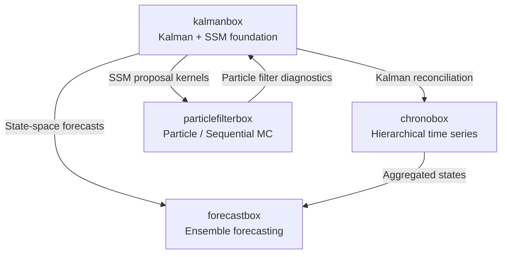

# Roadmap

This roadmap describes the current state, planned features, and long-term
vision for **kalmanbox** and its place in the
[NodesEcon](https://github.com/nodesecon) ecosystem.

!!! note "Living document"
    Priorities and timelines shift with community feedback, upstream
    dependencies, and contributor availability. Open a
    [GitHub Discussion](https://github.com/nodesecon/kalmanbox/discussions)
    to influence the direction.

---

## Current release — v0.5 (stable)

v0.5 represents a **production-ready foundation** for Kalman Filter and
State-Space modeling in Python. All core algorithms are implemented,
documented, and tested.

### Available now

<div class="grid cards" markdown>

-   :material-filter:{ .lg .middle } **Core Filters**

    ---

    - `KalmanFilter`: predict–update recursion, time-varying matrices
    - `RTSSmoother`: Rauch–Tung–Striebel backward smoother
    - `EKF`: Extended Kalman Filter with Jacobian linearization
    - `UKF`: Unscented Kalman Filter (Merwe scaled sigma-points)
    - `SquareRootFilter`: Cholesky-factored covariance propagation
    - `InformationFilter`: information-form KF for large state spaces
    - `EnKF`: Ensemble Kalman Filter with localization and inflation

-   :material-chart-timeline-variant:{ .lg .middle } **Structural Models**

    ---

    - `LocalLevel`: random-walk plus noise
    - `LocalLinearTrend`: stochastic trend + slope
    - `BSM`: Basic Structural Model (trend + seasonal + irregular)
    - `UCM`: Unobserved Components Model with flexible decomposition
    - Cycle component with stochastic damping
    - ARIMA(p,d,q)(P,D,Q)\_s in state-space form

-   :material-vector-combine:{ .lg .middle } **Advanced Models**

    ---

    - `DFM`: Dynamic Factor Model (EM + MLE, Bai–Ng IC)
    - `TVP`: Time-Varying Parameters (random walk + mean-reverting)
    - `MultivariateDFM`: unbalanced panel with arbitrary NaN patterns
    - Custom state-space via direct matrix specification

-   :material-function-variant:{ .lg .middle } **Estimation**

    ---

    - `MLE`: maximum likelihood via scipy optimizers
    - `EM`: Shumway–Stoffer EM algorithm with Louis SE correction
    - `GibbsSampler`: MCMC with conjugate Normal-Inverse-Wishart priors
    - `FFBS`: Forward-Filter Backward-Sample for posterior draws
    - Diffuse initialization (exact and approximate Rosenberg)

-   :material-stethoscope:{ .lg .middle } **Diagnostics**

    ---

    - Innovation tests: Ljung–Box, Jarque–Bera, KS
    - CUSUM stability test
    - Prediction error decomposition
    - Information criteria: AIC, BIC, HQIC, AICc
    - Likelihood ratio tests with boundary corrections
    - Rolling and expanding cross-validation
    - NEES and NIS filter consistency tests
    - Auxiliary residuals (disturbance smoother)

-   :material-chart-scatter-plot:{ .lg .middle } **Visualization & CLI**

    ---

    - 20+ dedicated plot functions (states, components, innovations,
      factor loadings, TVP coefficients)
    - Four built-in publication themes + custom theme API
    - HTML/PDF report generation
    - CLI: `fit`, `diagnose`, `experiment run`, `report generate`

</div>

---

## v0.6 — Q3 2026

v0.6 focuses on **online processing**, **GPU acceleration**, and
**automatic model selection**.

### Streaming / online Kalman Filter

Real-time data pipelines need single-step updates without re-running the
full filter. v0.6 will add:

```python
from kalmanbox import KalmanFilter

kf = KalmanFilter.local_level(sigma2_obs=1.0, sigma2_level=0.1)
state = kf.initialize()                      # diffuse or specified prior

# Online update loop
for y_t in data_stream:
    state = kf.update(state, y_t)            # single O(n²) step
    print(state.a, state.P)                  # immediately available
```

Key properties:

- `O(n²)` per step (n = state dimension), no batch re-processing.
- Thread-safe state object for concurrent consumers.
- Configurable forgetting factor for non-stationary adaptation.
- Integration with Python async generators (`async for y in stream`).

### JAX backend for GPU acceleration

The core predict–update recursion will be reimplementable in
[JAX](https://github.com/google/jax), enabling:

- **JIT compilation** via `jax.jit` for repeated filter calls.
- **GPU/TPU execution** for large state dimensions or batched datasets.
- **Automatic differentiation** through the filter for gradient-based MLE.

```python
from kalmanbox import KalmanFilter

kf = KalmanFilter.local_level(sigma2_obs=1.0, sigma2_level=0.1, backend="jax")
result = kf.filter(y)           # runs on GPU if available
grad_fn = kf.log_likelihood_grad()  # AD through the filter
```

The NumPy backend remains the default; JAX is opt-in.

### Automatic model selection

v0.6 will add an `AutoSSM` class that fits multiple structural model
specifications and selects the best by information criterion:

```python
from kalmanbox import AutoSSM

auto = AutoSSM(
    candidates=["local_level", "local_linear_trend", "bsm", "ucm"],
    criterion="aicc",
    cv_folds=5,
)
best = auto.fit(y)
print(best.model_name, best.aic)
```

Candidate models are evaluated in parallel using `concurrent.futures`.

### Other v0.6 items

| Feature | Description |
|---------|-------------|
| `KalmanFilter.batch_filter()` | Vectorized filter over multiple independent series |
| Interpolation confidence bands | Correct uncertainty for imputed missing observations |
| Sparse matrix support | `scipy.sparse` for block-diagonal DFM observation matrices |
| `kalmanbox.datasets` expansion | 10 additional curated macroeconomic and financial datasets |
| Improved CLI | `kalmanbox forecast` command with horizon, level, and fan-chart output |

---

## v0.7 — Q1 2027

### Regime-switching State-Space Models

Hamilton (1989) Markov-switching model embedded in state-space form:

$$x_t = \mu_{S_t} + \phi x_{t-1} + \varepsilon_t, \quad S_t \in \{0, 1\}$$

- `MarkovSwitchingSSM`: EM estimation via Kim (1994) filter.
- `RegimeSwitchingDFM`: factor model with regime-dependent loadings.
- Smooth transition variant (logistic instead of Markov).

### Non-Gaussian State-Space Models

Extend beyond the Gaussian assumption:

- **Student-t innovations**: robust to outliers via scale mixture representation.
- **Negative binomial observations**: count data (e.g., epidemic tracking).
- **Poisson structural model**: local level for count time series.
- Monte Carlo EM for non-Gaussian likelihood approximation.

### Variational Inference

Mean-field variational Bayes as a faster alternative to MCMC:

```python
from kalmanbox.bayesian import VariationalBayes

vb = VariationalBayes(model=kf, n_iter=1000)
posterior = vb.fit(y)
print(posterior.elbo_trace)    # evidence lower bound
print(posterior.mean, posterior.variance)
```

Gaussian variational family for state distributions; factored approximation
for hyperparameters.

---

## v1.0 — 2027

v1.0 marks API stability and long-term support (LTS):

- **Stable public API**: no breaking changes without a major version bump.
- **Full type completeness**: 100 % pyright strict mode compliance.
- **Documentation complete**: every public symbol has a docstring, user-guide
  page, and at least one runnable example.
- **Test coverage ≥ 95 %** branch coverage across the full public API.
- **Performance parity** with statsmodels' Kalman Filter implementation
  (NumPy backend) and 5–10× speedup with JAX backend on GPU.

---

## Ecosystem integration

kalmanbox is the **foundational layer** of the NodesEcon ecosystem.
Future releases will deepen integration with sibling libraries:



### chronobox integration

[chronobox](https://github.com/nodesecon/chronobox) handles hierarchical
time-series reconciliation. In v0.6, kalmanbox will expose:

- `KalmanReconciler`: Kalman-optimal reconciliation of hierarchical forecasts,
  propagating state uncertainty through the hierarchy.
- `HierarchicalSSM`: state-space representation of a complete hierarchy,
  enabling joint estimation of all levels.

```python
from kalmanbox.integrations.chronobox import KalmanReconciler

reconciler = KalmanReconciler(hierarchy=hier, base_forecasts=base)
coherent_forecasts = reconciler.reconcile(method="mint_kalman")
```

### forecastbox integration

[forecastbox](https://github.com/nodesecon/forecastbox) manages ensemble
forecasting pipelines. kalmanbox will contribute:

- `SSMForecaster`: a forecastbox-compatible estimator wrapping any kalmanbox
  model, returning point forecasts, intervals, and predictive distributions.
- `EnsembleSSM`: combine multiple structural models into a Bayesian model
  average using predictive likelihood weights.

```python
from kalmanbox.integrations.forecastbox import SSMForecaster

forecaster = SSMForecaster(model="bsm", criterion="aicc")
# Drop-in compatible with forecastbox pipelines
pipeline = forecastbox.Pipeline([("ssm", forecaster), ("reconcile", reconciler)])
```

### particlefilterbox integration

[particlefilterbox](https://github.com/nodesecon/particlefilterbox)
implements Sequential Monte Carlo methods. kalmanbox will provide:

- **Auxiliary Particle Filter** using Kalman-linearized proposal distributions
  (locally optimal importance weights for linear sub-models).
- **Rao-Blackwellized Particle Filter** (RBPF): marginalize linear Gaussian
  substructure analytically with the Kalman Filter, use particles only for
  the nonlinear discrete or non-Gaussian part.

```python
from kalmanbox.integrations.particlefilterbox import RaoBlackwellPF

rbpf = RaoBlackwellPF(
    linear_model=kf,       # Kalman-marginalized sub-model
    nonlinear_model=svpf,  # particle-tracked component
    n_particles=2000,
)
result = rbpf.filter(y)
```

---

## How to influence the roadmap

| Action | Effect |
|--------|--------|
| :thumbsup: Upvote a GitHub issue | Signals demand; high-vote issues move up the priority queue |
| Open a GitHub Discussion | Start design conversations before implementation |
| Submit a PR | Direct contribution is the fastest path to inclusion |
| Sponsor the project | Sustained funding enables dedicated maintainer time |

Features marked with a GitHub issue number are tracked and open for
contribution. Look for the
[:material-help-circle: `good first issue`](https://github.com/nodesecon/kalmanbox/labels/good%20first%20issue)
and
[:material-star: `help wanted`](https://github.com/nodesecon/kalmanbox/labels/help%20wanted)
labels.

!!! tip "Want to build a feature on this roadmap?"
    Open a GitHub Discussion describing your planned approach. Maintainers
    will review the design, flag concerns early, and assign the issue to you
    so no one duplicates the work.
