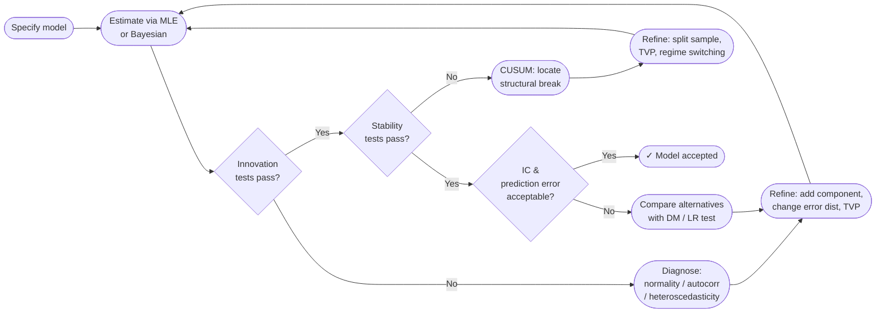

# Diagnostics

Fitting a state-space model is only half the work. Before trusting its filtered states,
forecasts, or parameter estimates you must verify that the model is correctly specified.
kalmanbox ships a comprehensive diagnostics toolkit covering every major validation category.

---

## Why diagnostics matter

A state-space model rests on a set of distributional assumptions:

- **Innovations** $v_t = y_t - Z_t a_t$ are uncorrelated and normally distributed with
  mean zero and covariance $F_t$.
- **Parameters** are constant over the sample (unless you explicitly model time-variation).
- **Initial conditions** are correctly specified.

Violations of these assumptions produce biased filtered states, unreliable confidence
intervals, and poor forecasts. Diagnostics tell you *which* assumption is broken and *where*
to look for the fix.

---

## Diagnostic categories

<div class="grid cards" markdown>

-   :material-test-tube:{ .lg .middle } **Innovation tests**

    ---

    Test the one-step-ahead prediction errors for normality, independence, and
    homoscedasticity. The primary diagnostic layer for any state-space model.

    [:octicons-arrow-right-24: Innovation Tests](innovation-tests.md)

-   :material-chart-scatter-plot:{ .lg .middle } **Residual analysis**

    ---

    Standardised innovations, auxiliary residuals, and smooth-state residuals.
    Includes ACF, QQ-plot, histogram, and formal tests.

    [:octicons-arrow-right-24: Residual Analysis](residuals.md)

-   :material-pound:{ .lg .middle } **Information criteria**

    ---

    AIC, BIC, AICc, and Hannan-Quinn for model selection. Derivations from
    Kullback-Leibler divergence and Bayesian marginal likelihood. Parameter
    counting for state-space models including diffuse initialisation.

    [:octicons-arrow-right-24: Information Criteria](information-criteria.md)

-   :material-scale-balance:{ .lg .middle } **Likelihood ratio test**

    ---

    Test nested models using LR = 2(ℓ₁ − ℓ₀) ~ χ²_q. Includes boundary
    corrections for variance components, Wilks' theorem, and guidance on
    degrees of freedom in state-space settings.

    [:octicons-arrow-right-24: Likelihood Ratio Test](likelihood-ratio.md)

-   :material-rotate-3d-variant:{ .lg .middle } **Cross-validation**

    ---

    Rolling-window, expanding-window, one-step-ahead, and leave-future-out CV.
    Metrics: RMSE, MAE, MASE, CRPS, log-predictive density. Computational
    strategies for expensive state-space models.

    [:octicons-arrow-right-24: Cross-Validation](cross-validation.md)

-   :material-chart-waterfall:{ .lg .middle } **CUSUM & stability**

    ---

    Cumulative-sum tests for structural breaks in the mean and variance of
    recursive residuals. Essential for detecting regime changes.

    [:octicons-arrow-right-24: CUSUM](cusum.md)

-   :material-target:{ .lg .middle } **Prediction error analysis**

    ---

    One-step and multi-step forecast accuracy metrics (RMSE, MAE, MAPE, Theil U).
    Diebold-Mariano test for comparing competing models.

    [:octicons-arrow-right-24: Prediction Errors](prediction-error.md)

-   :material-chart-bell-curve-cumulative:{ .lg .middle } **Convergence**

    ---

    MLE optimiser convergence checks. Bayesian diagnostics: $\hat{R}$, ESS,
    traceplots, Geweke test.

    [:octicons-arrow-right-24: Convergence](convergence.md)

</div>

---

## Diagnostic workflow

The recommended three-stage workflow is: **estimate → diagnose → refine**.



---

## Quick-start: complete diagnostic suite

=== "One-liner"

    ```python
    from kalmanbox import LocalLevelModel
    from kalmanbox.diagnostics import full_diagnostic_report

    model = LocalLevelModel()
    results = model.fit(y)

    report = full_diagnostic_report(results)
    print(report)
    ```

=== "Step-by-step"

    ```python
    from kalmanbox import BSM
    from kalmanbox.diagnostics import (
        innovation_tests,
        cusum,
        prediction_errors,
        aic, bic,
    )
    from kalmanbox.visualization import plot_diagnostics

    # Fit
    model = BSM(period=12)
    results = model.fit(y)

    # Layer 1: innovations
    inn = innovation_tests(results)
    print(inn.summary())

    # Layer 2: structural stability
    cs = cusum(results)
    cs.plot()

    # Layer 3: forecast accuracy
    pe = prediction_errors(results)
    print(pe.metrics())

    # Layer 4: model selection
    print(f"AIC={aic(results):.2f}  BIC={bic(results):.2f}")

    # All-in-one plot
    plot_diagnostics(results)
    ```

---

## Interpreting the diagnostic table

`full_diagnostic_report` returns a structured table. Here is a typical output with
interpretation guidance:

| Test | Statistic | p-value | Verdict | Action if failing |
|------|-----------|---------|---------|-------------------|
| Ljung-Box (h=20) | $Q = 18.4$ | 0.56 | **Pass** | — |
| Jarque-Bera | $JB = 5.2$ | 0.07 | **Marginal** | Check for outliers or fat tails |
| ARCH-LM (h=5) | $LM = 3.1$ | 0.68 | **Pass** | — |
| CUSUM | — | — | **Within bounds** | — |
| CUSUM-SQ | — | — | **Marginal** | Inspect mid-sample variance shift |
| AIC | 1 234.6 | — | — | Compare with alternatives |
| RMSE (1-step) | 0.182 | — | — | Compare with benchmark |

!!! tip "Significance levels"
    The conventional $p < 0.05$ threshold is conservative for residual tests in state-space
    models because the number of estimated parameters reduces the effective degrees of freedom.
    Consider using $p < 0.01$ for large samples, and always inspect plots alongside $p$-values.

---

## What "good residuals" look like

| Property | Formal test | Visual check | Typical failure mode |
|----------|-------------|--------------|----------------------|
| Zero mean | $t$-test | Residual plot | Omitted constant component |
| No autocorrelation | Ljung-Box | ACF plot | Missing AR or seasonal component |
| Normality | Jarque-Bera | QQ-plot | Outliers, fat tails, asymmetry |
| Homoscedasticity | ARCH-LM | Squared residuals ACF | Volatility clustering |
| No structural break | CUSUM | CUSUM plot | Regime change in data |

---

## Related pages

- [Theory: state-space foundations](../theory/state-space-theory.md)
- [Theory: identifiability](../theory/identifiability.md)
- [Theory: MLE theory](../theory/mle-theory.md)
- [Visualization: diagnostic plots](../visualization/diagnostics.md)
- [API: diagnostics module](../api/diagnostics.md)
