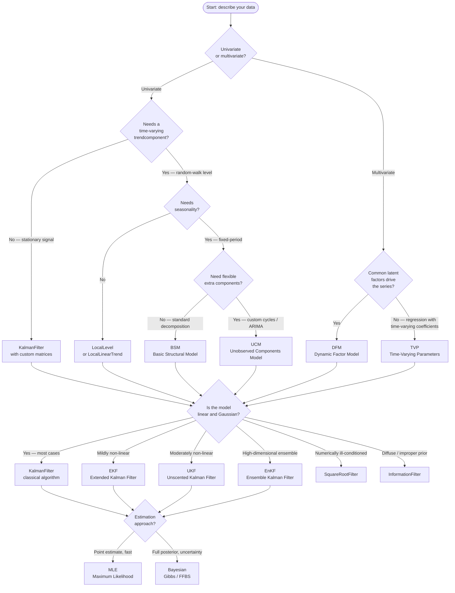

# Choosing a Model

`kalmanbox` provides a rich palette of state-space models and filters. This guide
helps you navigate the options by working through a decision tree, comparing
similar models, and explaining when each estimation strategy pays off.

!!! tip "Haven't seen the models yet?"
    Start with [Core Concepts](core-concepts.md) for the mathematical foundations,
    then return here to map your problem to the right class.

---

## Decision tree

The flowchart below routes you from your data characteristics to the most
appropriate model. Follow the branch that best describes your situation.



---

## Univariate structural models

### Local Level and Local Linear Trend

The simplest models for a univariate series with a stochastic trend.

**Local Level** — a random walk observed with noise:

$$
\begin{aligned}
\mu_{t+1} &= \mu_t + \eta_t, &\quad \eta_t \sim \mathcal{N}(0, \sigma_\eta^2) \\
y_t       &= \mu_t + \varepsilon_t, &\quad \varepsilon_t \sim \mathcal{N}(0, \sigma_\varepsilon^2)
\end{aligned}
$$

**Local Linear Trend** adds a slope $\nu_t$ that itself follows a random walk:

$$
\begin{aligned}
\mu_{t+1} &= \mu_t + \nu_t + \xi_t \\
\nu_{t+1} &= \nu_t + \zeta_t \\
y_t       &= \mu_t + \varepsilon_t
\end{aligned}
$$

Use these models when you only need trend extraction with no seasonal pattern.

=== "Local Level"

    ```python
    import numpy as np
    from kalmanbox import LocalLevel

    rng = np.random.default_rng(0)
    y = np.cumsum(rng.normal(0, 1, 200)) + rng.normal(0, 3, 200)

    model = LocalLevel(y)
    res = model.fit()                      # MLE via scipy.optimize

    print(res.summary())
    trend = res.smoothed_state[:, 0]       # extracted trend
    ```

=== "Local Linear Trend"

    ```python
    import numpy as np
    from kalmanbox import LocalLinearTrend

    rng = np.random.default_rng(0)
    t = np.arange(200)
    y = 0.05 * t + np.cumsum(rng.normal(0, 0.3, 200)) + rng.normal(0, 2, 200)

    model = LocalLinearTrend(y)
    res = model.fit()

    level = res.smoothed_state[:, 0]       # stochastic level
    slope = res.smoothed_state[:, 1]       # stochastic slope
    print(f"Final slope estimate: {slope[-1]:.4f}")
    ```

---

## BSM vs UCM

Both models decompose a univariate series into unobserved components. The
difference lies in how much structure is fixed vs. configurable.

### BSM — Basic Structural Model

Proposed by Harvey (1989), BSM has a canonical three-part decomposition:

$$
y_t = \mu_t + \gamma_t + \varepsilon_t
$$

where $\mu_t$ is a Local Linear Trend, $\gamma_t$ is a deterministic-or-stochastic
seasonal component with period $s$, and $\varepsilon_t$ is irregular noise.

The seasonal is modelled as $\sum_{j=0}^{s-1} \gamma_{t-j} = \omega_t$ where
$\omega_t \sim \mathcal{N}(0, \sigma_\omega^2)$.

**Choose BSM when:**

- Your series has a single, well-known seasonal period (monthly: $s=12$, quarterly: $s=4$).
- You want a robust baseline decomposition with minimal tuning.
- Interpretability of trend + seasonal + irregular is more important than flexibility.

```python
import numpy as np
import pandas as pd
from kalmanbox import BSM

# Monthly airline passengers (Box & Jenkins)
y = pd.read_csv("airline.csv", index_col=0, parse_dates=True)["passengers"].values

model = BSM(y, period=12)
res = model.fit()

print(res.summary())

# Decomposed components
trend    = res.smoothed_state[:, 0]
seasonal = res.smoothed_state[:, 2]
```

### UCM — Unobserved Components Model

UCM generalises BSM by letting you compose any combination of:

- Multiple stochastic trends (level + slope independently specified)
- Multiple seasonal components at different periods
- Cycle components with trigonometric representation
- ARMA components for the irregular
- Regression effects with time-varying or fixed coefficients

**Choose UCM when:**

- Your series has multiple seasonality (e.g., daily data with weekly + annual cycles).
- You need a cycle component with an estimated period and damping factor.
- You want an ARMA$(p, q)$ structure on the irregular.
- You need to impose constraints (e.g., fix slope variance to zero for a deterministic trend).

```python
import numpy as np
from kalmanbox import UCM

rng = np.random.default_rng(42)
T = 300

# Simulate series with trend + 12-period + 4-period seasonality
t = np.arange(T)
y = (0.02 * t
     + 3 * np.sin(2 * np.pi * t / 12)
     + 1.5 * np.cos(2 * np.pi * t / 4)
     + rng.normal(0, 0.5, T))

model = UCM(
    y,
    level=True,            # stochastic level
    slope=True,            # stochastic slope
    seasonal=[12, 4],      # two seasonal periods
    cycle=False,           # no trigonometric cycle
    irregular=True,        # iid irregular component
)
res = model.fit()

components = res.components()  # dict: level, seasonal_12, seasonal_4, irregular
```

### BSM vs UCM at a glance

| Criterion              | BSM                          | UCM                              |
|------------------------|------------------------------|----------------------------------|
| Seasonal periods       | Single fixed period          | Multiple, user-specified         |
| Cycle component        | No                           | Yes (trigonometric, with damping)|
| ARMA on irregular      | No                           | Yes                              |
| Parameters to specify  | Very few (`period`)          | Moderate (component flags)       |
| Estimation speed       | Fast                         | Slightly slower (more params)    |
| Interpretability       | High                         | High, but requires more care     |
| Typical use case       | Seasonal decomposition, X-11 | Complex multi-frequency signals  |

---

## DFM vs TVP

### DFM — Dynamic Factor Model

DFM extracts a small number of common latent factors $f_t \in \mathbb{R}^r$
that drive a large panel of $N$ observed series $y_t \in \mathbb{R}^N$:

$$
\begin{aligned}
y_t &= \Lambda f_t + \varepsilon_t \\
f_t &= A_1 f_{t-1} + \cdots + A_p f_{t-p} + \eta_t
\end{aligned}
$$

where $\Lambda$ ($N \times r$) is the factor loading matrix and $r \ll N$.

**Choose DFM when:**

- You have many correlated time series and want dimension reduction.
- Economic intuition suggests a few hidden forces (e.g., "business cycle", "global demand") drive co-movements.
- You want coincident or leading indicators from a panel (e.g., GDP nowcasting).
- The goal is forecasting a target variable using the extracted factors as predictors.

```python
import numpy as np
from kalmanbox import DFM

rng = np.random.default_rng(42)
T, N, r = 200, 20, 2   # 200 obs, 20 series, 2 factors

# Simulate panel: two common factors + idiosyncratic noise
F_true = rng.normal(0, 1, (T, r))
Lambda  = rng.normal(0, 1, (N, r))
y = F_true @ Lambda.T + rng.normal(0, 0.5, (T, N))

model = DFM(
    y,
    k_factors=2,           # number of latent factors
    factor_order=1,        # VAR(1) for factor dynamics
)
res = model.fit()

factors = res.smoothed_state[:, :2]    # extracted factor paths
loadings = res.factor_loadings          # Lambda matrix
print(f"Explained variance ratio: {res.explained_variance_ratio_:.3f}")
```

### TVP — Time-Varying Parameters

TVP models a regression where the slope vector $\beta_t$ evolves as a random walk:

$$
\begin{aligned}
y_t &= x_t^\top \beta_t + \varepsilon_t \\
\beta_t &= \beta_{t-1} + \eta_t, \quad \eta_t \sim \mathcal{N}(0, Q)
\end{aligned}
$$

This nests OLS (when $Q = 0$) and allows gradual structural change without
imposing a known break date.

**Choose TVP when:**

- You have a regression setup ($y_t = x_t^\top \beta + \varepsilon_t$) but suspect
  the relationship changes over time.
- You want to test for or model structural breaks as a smooth process.
- Economic theory suggests time-varying risk premia, elasticities, or multipliers
  (e.g., time-varying CAPM beta, rolling inflation pass-through).
- You prefer a continuous model of change over break-point detection.

```python
import numpy as np
from kalmanbox import TVP

rng = np.random.default_rng(0)
T = 300

# Simulate: y = beta_0(t) + beta_1(t) * x + eps
x = rng.normal(0, 1, T)
beta_0 = np.cumsum(rng.normal(0, 0.05, T))  # drifting intercept
beta_1 = 1 + np.cumsum(rng.normal(0, 0.02, T))  # drifting slope
y = beta_0 + beta_1 * x + rng.normal(0, 0.5, T)

# Design matrix: [constant, x]
X = np.column_stack([np.ones(T), x])

model = TVP(y, exog=X)
res = model.fit()

beta_smoothed = res.smoothed_state     # shape (T, 2)
print(f"Mean slope β₁ over time: {beta_smoothed[:, 1].mean():.3f}")
```

### DFM vs TVP at a glance

| Criterion               | DFM                             | TVP                                  |
|-------------------------|---------------------------------|--------------------------------------|
| Data layout             | Multivariate panel ($T \times N$) | Univariate $y$ with regressors $X$  |
| Unknown quantity        | Latent factors $f_t$            | Regression coefficients $\beta_t$    |
| Primary use             | Dimension reduction, nowcasting | Structural change, elasticities      |
| Number of series        | Many ($N$ large)                | Single (or a few) target series      |
| Requires regressors     | No                              | Yes                                  |
| Identification          | Rotation normalisation needed   | Straightforward                      |
| Typical domains         | Macroeconomics, finance panels  | CAPM, Phillips curve, pass-through   |

---

## Choosing a filter algorithm

Once you have chosen your model, the filter is often determined by the model's
linearity. The table below summarises when to override the default.

### Classical KalmanFilter

The standard recursive algorithm for **linear Gaussian** state-space models.
All models in `kalmanbox` — `LocalLevel`, `BSM`, `UCM`, `DFM`, `TVP` — use it
internally unless you explicitly request an alternative.

```python
from kalmanbox import KalmanFilter
from kalmanbox.core.representation import StateSpaceRepresentation
import numpy as np

rep = StateSpaceRepresentation(
    T=np.eye(2), Z=np.array([[1, 0]]),
    R=np.eye(2), Q=np.diag([0.1, 0.05]),
    H=np.array([[1.0]]),
    a1=np.zeros(2), P1=np.eye(2) * 100,
)
kf = KalmanFilter(rep)
res = kf.filter(y)
```

### EKF — Extended Kalman Filter

Linearises non-linear functions $f(\cdot)$ and $h(\cdot)$ via first-order Taylor
expansion at each time step. Cheap but biased for strongly non-linear dynamics.

**Use when:** the non-linearity is mild (smooth functions, moderate curvature),
e.g., log-returns of a stochastic volatility model or a mildly non-linear sensor.

```python
import numpy as np
from kalmanbox import EKF

def f(x):   # non-linear transition: x² / (1 + x²) + noise
    return np.array([x[0]**2 / (1 + x[0]**2)])

def h(x):   # non-linear observation: sin(x)
    return np.array([np.sin(x[0])])

def F_jac(x):  # Jacobian of f
    denom = (1 + x[0]**2)**2
    return np.array([[2 * x[0] / denom]])

def H_jac(x):  # Jacobian of h
    return np.array([[np.cos(x[0])]])

ekf = EKF(
    f=f, h=h,
    F_jacobian=F_jac, H_jacobian=H_jac,
    Q=np.array([[0.1]]),
    R=np.array([[0.5]]),
    x0=np.array([0.0]),
    P0=np.array([[1.0]]),
)
res = ekf.filter(y)
```

### UKF — Unscented Kalman Filter

Uses a set of deterministically chosen sigma points to propagate the distribution
through non-linear functions. No Jacobians required; better accuracy than EKF for
moderate non-linearity at a modest extra cost.

**Use when:** non-linearity is significant (e.g., angles, exponentials, product
interactions) but the state dimension remains tractable ($m \lesssim 50$).

```python
import numpy as np
from kalmanbox import UKF

def f(x):
    return np.array([np.cos(x[0]), x[1]])   # rotation dynamics

def h(x):
    return np.array([np.sqrt(x[0]**2 + x[1]**2)])  # range observation

ukf = UKF(
    f=f, h=h,
    Q=np.diag([0.01, 0.01]),
    R=np.array([[0.5]]),
    x0=np.array([1.0, 0.0]),
    P0=np.eye(2) * 0.1,
    alpha=1e-3, beta=2.0, kappa=0.0,   # UKF tuning parameters
)
res = ukf.filter(y)
```

### SquareRootFilter

Maintains the Cholesky factor of $P_{t|t}$ instead of $P_{t|t}$ itself, avoiding
loss of positive semi-definiteness in long series with near-zero variances.

**Use when:** numerical instability appears (non-positive-definite covariances,
`NaN` log-likelihoods) or when the series is very long and residual numerical
errors accumulate.

```python
from kalmanbox import SquareRootFilter
from kalmanbox.core.representation import StateSpaceRepresentation
import numpy as np

rep = StateSpaceRepresentation(...)   # same as KalmanFilter
sqrtf = SquareRootFilter(rep)
res = sqrtf.filter(y)                 # drop-in replacement
```

### InformationFilter

Works with the **information matrix** $\Omega_{t|t} = P_{t|t}^{-1}$ and the
information vector $\xi_{t|t} = \Omega_{t|t} a_{t|t}$. Well-suited for
diffuse initialisation (infinite prior variance → zero information) and for
sparse or missing observations.

**Use when:** you need a completely diffuse (improper) prior, or observations are
so sparse that inverting $P_{t|t}$ is ill-conditioned.

```python
from kalmanbox import InformationFilter
from kalmanbox.core.representation import StateSpaceRepresentation
import numpy as np

rep = StateSpaceRepresentation(...)
inf_f = InformationFilter(rep, diffuse=True)   # diffuse initialisation
res = inf_f.filter(y)
```

### EnKF — Ensemble Kalman Filter

Represents the state distribution as an ensemble of $N_e$ particles and
propagates them through (possibly non-linear) dynamics. Scales to very high
state dimensions ($m \sim 10^4 – 10^6$) where storing a full covariance matrix
is infeasible.

**Use when:** state dimension is so large that a dense $P_t$ matrix cannot be
stored or inverted (geophysics, data assimilation, high-dimensional finance
models).

```python
import numpy as np
from kalmanbox import EnKF

def f(X):   # X shape: (m, N_e) — apply transition to each ensemble member
    return X + np.random.normal(0, 0.1, X.shape)

def h(X):   # observation operator
    return X[:2, :]   # observe first two states

enkf = EnKF(
    f=f, h=h,
    R=np.eye(2) * 0.5,
    x0=np.zeros(50),        # 50-dimensional state
    P0=np.eye(50),
    n_ensemble=200,          # number of ensemble members
)
res = enkf.filter(y)
```

### Filter comparison table

| Filter              | Model class      | Non-linear? | Jacobians? | State dim | When to use                          |
|---------------------|------------------|-------------|------------|-----------|--------------------------------------|
| `KalmanFilter`      | Linear Gaussian  | No          | —          | Any       | Default for all standard models      |
| `EKF`               | Mildly non-linear| Yes         | Required   | Small–Med | Smooth non-linearities, cheap option |
| `UKF`               | Non-linear       | Yes         | Not needed | Small–Med | Better accuracy than EKF, no Jacobian|
| `SquareRootFilter`  | Linear Gaussian  | No          | —          | Any       | Numerical stability, long series     |
| `InformationFilter` | Linear Gaussian  | No          | —          | Any       | Diffuse prior, sparse observations   |
| `EnKF`              | Non-linear       | Yes         | Not needed | Very large| High-dimensional data assimilation   |

---

## MLE vs Bayesian estimation

### Maximum Likelihood Estimation (MLE)

MLE finds the parameter vector $\theta^* = \arg\max_\theta \ell(\theta; y_{1:T})$
where the log-likelihood is computed via the prediction-error decomposition:

$$
\ell(\theta) = -\frac{T}{2}\log(2\pi) - \frac{1}{2}\sum_{t=1}^{T}\left[\log|F_t| + v_t^\top F_t^{-1} v_t\right]
$$

All `kalmanbox` structural models expose a `.fit()` method that calls an
optimizer (L-BFGS-B by default) over the transformed parameter space.

**Choose MLE when:**

- You want a fast, single point estimate.
- Sample size is large (MLE is consistent and asymptotically efficient).
- Uncertainty about the model parameters is secondary to the state estimates.
- You need to compare models via AIC / BIC.

```python
from kalmanbox import BSM
import numpy as np

y = np.loadtxt("quarterly_gdp.csv")

model = BSM(y, period=4)
res = model.fit(method="lbfgsb", maxiter=500)

print(res.summary())       # parameter estimates + standard errors
print(f"AIC: {res.aic:.2f}  BIC: {res.bic:.2f}")
```

### Bayesian Estimation (Gibbs Sampling / FFBS)

Bayesian inference targets the joint posterior:

$$
p(\theta, \alpha_{1:T} \mid y_{1:T}) \propto p(y_{1:T} \mid \alpha_{1:T}, \theta)\, p(\alpha_{1:T} \mid \theta)\, p(\theta)
$$

`kalmanbox` implements two MCMC samplers:

- **GibbsSampler** — iterates over blocks of parameters, sampling each
  conditionally on the others and on the smoothed states.
- **FFBS (Forward-Filter Backward-Sample)** — samples entire state trajectories
  $\alpha_{1:T}$ in one backward pass given the filter output; used as the
  state draw inside the Gibbs loop.

**Choose Bayesian estimation when:**

- You want the full posterior distribution over parameters and states.
- Prior information is available and should be formally incorporated.
- The sample is small and frequentist asymptotics are unreliable.
- You need credible intervals (not just standard errors) for states.
- The model is partially identified and you need shrinkage priors.

=== "GibbsSampler"

    ```python
    import numpy as np
    from kalmanbox import LocalLevel, GibbsSampler
    from kalmanbox.bayesian.priors import InverseGammaPrior

    y = np.loadtxt("nile.csv")

    model = LocalLevel(y)

    priors = {
        "sigma2_eta": InverseGammaPrior(shape=2.0, scale=1.0),
        "sigma2_eps": InverseGammaPrior(shape=2.0, scale=5.0),
    }

    sampler = GibbsSampler(model, priors=priors)
    trace = sampler.sample(
        n_iter=5000,
        burnin=1000,
        thin=2,
        seed=42,
    )

    # Posterior means
    print(f"σ²_η: {trace['sigma2_eta'].mean():.4f}")
    print(f"σ²_ε: {trace['sigma2_eps'].mean():.4f}")

    # Credible intervals
    import numpy as np
    ci = np.percentile(trace["sigma2_eta"], [2.5, 97.5])
    print(f"95% CI for σ²_η: [{ci[0]:.4f}, {ci[1]:.4f}]")
    ```

=== "FFBS"

    ```python
    import numpy as np
    from kalmanbox import LocalLevel, FFBS

    y = np.loadtxt("nile.csv")
    model = LocalLevel(y)

    # Draw state trajectories conditional on fixed parameters
    sigma2_eta, sigma2_eps = 1464.0, 15099.0
    model.update(sigma2_eta=sigma2_eta, sigma2_eps=sigma2_eps)

    ffbs = FFBS(model)
    state_draws = ffbs.sample(n_draws=1000, seed=0)
    # state_draws shape: (1000, T, m)

    # Posterior mean trajectory
    mean_trajectory = state_draws.mean(axis=0)[:, 0]
    print(f"State draw shape: {state_draws.shape}")
    ```

### MLE vs Bayesian at a glance

| Criterion               | MLE                               | Bayesian (Gibbs / FFBS)                |
|-------------------------|-----------------------------------|----------------------------------------|
| Output                  | Point estimates $\hat{\theta}$    | Full posterior $p(\theta \mid y)$      |
| Uncertainty             | Standard errors (asymptotic)      | Credible intervals (exact)             |
| Speed                   | Fast (optimizer, minutes)         | Slower (MCMC, minutes to hours)        |
| Prior information       | Not used                          | Formally incorporated                  |
| Small samples           | Potentially unreliable            | Reliable with informative priors       |
| Model comparison        | AIC / BIC                         | Bayes factors, WAIC, LOO-CV            |
| State uncertainty       | Filtered/smoothed only            | Full posterior over state paths        |
| Implementation          | `model.fit()`                     | `GibbsSampler(model).sample()`         |

---

## Summary table

The table below consolidates all models and their key characteristics for
quick reference.

| Model / Class           | Series type    | Components                      | Estimation  | Complexity | Speed  | Typical use case                         |
|-------------------------|----------------|---------------------------------|-------------|------------|--------|------------------------------------------|
| `KalmanFilter`          | Univariate     | Custom (user-supplied matrices) | MLE / Bayes | Low        | Fast   | Custom linear Gaussian models            |
| `LocalLevel`            | Univariate     | Level                           | MLE / Bayes | Very low   | Fast   | Random-walk signal extraction            |
| `LocalLinearTrend`      | Univariate     | Level + slope                   | MLE / Bayes | Low        | Fast   | Trending series, growth rates            |
| `BSM`                   | Univariate     | Trend + seasonal + irregular    | MLE / Bayes | Low        | Fast   | Seasonal decomposition (monthly, qtrly)  |
| `UCM`                   | Univariate     | Flexible components + cycles    | MLE / Bayes | Medium     | Medium | Multi-freq seasonality, custom cycles    |
| `DFM`                   | Multivariate   | Latent factors + idiosyncratic  | MLE / Bayes | High       | Medium | Panel data, nowcasting, index building   |
| `TVP`                   | Univariate     | Regression + time-varying $\beta$ | MLE / Bayes | Medium   | Medium | Structural change, elasticities          |
| `EKF`                   | Any            | Custom non-linear               | MLE         | Medium     | Fast   | Mildly non-linear dynamics               |
| `UKF`                   | Any            | Custom non-linear               | MLE         | Medium     | Medium | Non-linear, no Jacobian available        |
| `SquareRootFilter`      | Univariate     | Custom (numerically stable)     | MLE         | Low        | Fast   | Long series, near-degenerate covariances |
| `InformationFilter`     | Univariate     | Custom (diffuse prior)          | MLE         | Low        | Fast   | Diffuse initialisation, sparse obs       |
| `EnKF`                  | High-dim.      | Ensemble-based non-linear       | —           | Very high  | Medium | State dim $> 10^3$, geophysics, finance  |
| `GibbsSampler`          | Univariate     | Any `kalmanbox` model           | Bayesian    | High       | Slow   | Full posterior, small samples, priors    |
| `FFBS`                  | Univariate     | Any `kalmanbox` model           | Bayesian    | Medium     | Medium | State trajectory draws inside Gibbs loop |

---

## Next steps

<div class="grid cards" markdown>

-   :material-chart-line:{ .lg .middle } **User Guide — Structural Models**

    ---

    Deep dives into BSM, UCM, Local Level and Local Linear Trend with
    mathematical details and parameter interpretation.

    [:octicons-arrow-right-24: Structural models](../user-guide/structural/index.md)

-   :material-vector-combine:{ .lg .middle } **User Guide — Advanced Models**

    ---

    Full reference for DFM and TVP, including identification, rotation
    normalisation, and forecasting with extracted factors.

    [:octicons-arrow-right-24: Advanced models](../user-guide/advanced/index.md)

-   :material-filter:{ .lg .middle } **User Guide — Alternative Filters**

    ---

    When and how to use EKF, UKF, Square-Root, Information, and Ensemble
    Kalman Filters in practice.

    [:octicons-arrow-right-24: Alternative filters](../user-guide/filters/index.md)

-   :material-sigma:{ .lg .middle } **User Guide — Bayesian Estimation**

    ---

    Setting priors, running the Gibbs sampler, and diagnosing MCMC
    convergence for state-space models.

    [:octicons-arrow-right-24: Bayesian estimation](../user-guide/bayesian/index.md)

-   :material-school:{ .lg .middle } **Tutorials**

    ---

    End-to-end worked examples: Nile river (Local Level), airline passengers
    (BSM), US macro (DFM), and time-varying CAPM (TVP).

    [:octicons-arrow-right-24: Tutorials](../tutorials/index.md)

-   :material-book-open-variant:{ .lg .middle } **Core Concepts**

    ---

    State-space form, Kalman recursions, the prediction-error decomposition,
    and smoothing — the mathematical backbone of every model.

    [:octicons-arrow-right-24: Core concepts](core-concepts.md)

</div>
