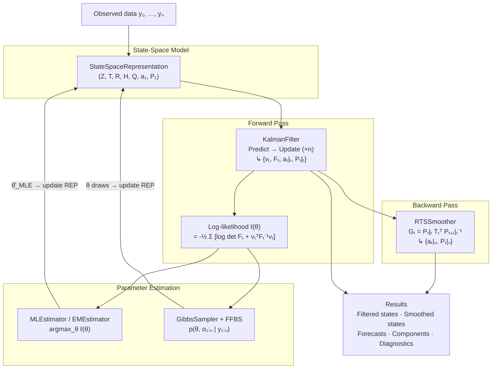

# Core Concepts

This page explains the four theoretical pillars of `kalmanbox`:

1. **State-Space Representation** — the mathematical framework that unifies all models
2. **Kalman Filter** — the forward recursion that tracks hidden states in real time
3. **RTS Smoother** — the backward pass that refines estimates using the full dataset
4. **Maximum Likelihood Estimation** — how unknown parameters are learned from data

If you have worked through the [Quickstart](quickstart.md) and want to understand
*why* the code works, or if you need the mental model before reaching for the
[User Guide](../user-guide/index.md), this is the right page.

!!! tip "Mathematical prerequisites"
    Familiarity with matrix algebra and basic probability (Gaussian distributions,
    conditional expectation) is helpful. The [Theory section](../theory/index.md)
    contains formal derivations with full proofs.

---

## 1  State-Space Representation

### The two equations

Every model in `kalmanbox` — from the simplest `LocalLevel` to a multivariate
`DFM` — is a special case of the **linear Gaussian state-space model** defined
by two stochastic difference equations:

**Observation equation** — relates the observed data $y_t$ to the hidden state
$\alpha_t$:

$$
y_t = Z_t \, \alpha_t + d_t + \varepsilon_t, \qquad
\varepsilon_t \sim \mathcal{N}(0,\, H_t)
$$

**State transition equation** — describes how the hidden state evolves over time:

$$
\alpha_{t+1} = T_t \, \alpha_t + c_t + R_t \, \eta_t, \qquad
\eta_t \sim \mathcal{N}(0,\, Q_t)
$$

The two noise processes are mutually independent: $\operatorname{Cov}(\varepsilon_t, \eta_s) = 0$
for all $t, s$.

### System matrices

| Symbol | Dimension | Name | Role |
|:------:|:---------:|:-----|:-----|
| $Z_t$ | $p \times m$ | Design / observation matrix | Maps state to observable space |
| $T_t$ | $m \times m$ | State transition matrix | Propagates state one step forward |
| $R_t$ | $m \times r$ | Selection matrix | Routes disturbances into the state |
| $H_t$ | $p \times p$ | Observation noise covariance | Measurement error magnitude |
| $Q_t$ | $r \times r$ | State noise covariance | Process noise magnitude |
| $d_t$ | $p \times 1$ | Observation intercept | Deterministic component of $y_t$ |
| $c_t$ | $m \times 1$ | State intercept | Deterministic drift in $\alpha_t$ |

where $p$ = number of observables, $m$ = number of states, $r$ = number of
state disturbances ($r \le m$; often $r = m$).

The subscript $t$ signals that matrices can be **time-varying**, but most
models use constant matrices ($Z_t = Z$, $T_t = T$, etc.).

### Initial conditions

The recursion starts at $t = 1$ with:

$$
\alpha_1 \sim \mathcal{N}(a_1,\; P_1)
$$

`kalmanbox` supports two initialisation strategies:

- **Diffuse**: $P_1 = \kappa I_m$ with $\kappa \to \infty$ — used when no prior
  information is available. The first few observations are handled by the
  exact diffuse initialisation of Durbin & Koopman (2012).
- **Stationary**: $P_1$ solves the discrete Lyapunov equation
  $P_1 = T P_1 T^\top + R Q R^\top$ — valid when the state is stationary.

See [Diffuse Initialisation](../user-guide/kalman/diffuse-initialization.md)
for details.

### From equations to matrices: three worked examples

=== "Local Level"

    The simplest non-trivial model: the observed series tracks a slowly
    drifting mean plus noise.

    $$
    \begin{aligned}
    y_t &= \mu_t + \varepsilon_t, &\varepsilon_t &\sim \mathcal{N}(0, \sigma_\varepsilon^2) \\
    \mu_{t+1} &= \mu_t + \eta_t, &\eta_t &\sim \mathcal{N}(0, \sigma_\eta^2)
    \end{aligned}
    $$

    **System matrices** ($m=1$, $p=1$, $r=1$):

    $$
    Z = [1], \quad T = [1], \quad R = [1], \quad H = [\sigma_\varepsilon^2], \quad Q = [\sigma_\eta^2]
    $$

=== "Local Linear Trend"

    Extends Local Level with a stochastic slope $\nu_t$. State vector:
    $\alpha_t = [\mu_t,\, \nu_t]^\top$.

    $$
    \begin{aligned}
    y_t &= \mu_t + \varepsilon_t \\
    \mu_{t+1} &= \mu_t + \nu_t + \xi_t \\
    \nu_{t+1} &= \nu_t + \zeta_t
    \end{aligned}
    $$

    **System matrices** ($m=2$, $p=1$, $r=2$):

    $$
    Z = \begin{bmatrix}1 & 0\end{bmatrix}, \quad
    T = \begin{bmatrix}1 & 1 \\ 0 & 1\end{bmatrix}, \quad
    R = I_2, \quad
    H = [\sigma_\varepsilon^2], \quad
    Q = \begin{bmatrix}\sigma_\xi^2 & 0 \\ 0 & \sigma_\zeta^2\end{bmatrix}
    $$

=== "AR(1)"

    A first-order autoregression $y_t = \phi y_{t-1} + e_t$ in state-space form
    (single-state, no observation noise):

    $$
    Z = [1], \quad T = [\phi], \quad R = [1], \quad H = [0], \quad Q = [\sigma_e^2]
    $$

    State-space form enables exact likelihood computation and handling of
    missing observations, neither of which is trivial with a standard AR fit.

### Representing models in kalmanbox

```python
import numpy as np
from kalmanbox.core.representation import StateSpaceRepresentation

# Local Level: one state (μ_t), one observable (y_t)
rep = StateSpaceRepresentation(
    T=np.array([[1.0]]),           # state transition
    Z=np.array([[1.0]]),           # observation
    R=np.array([[1.0]]),           # noise selection
    Q=np.array([[0.25]]),          # state noise variance  (σ²_η)
    H=np.array([[4.00]]),          # observation noise variance (σ²_ε)
    a1=np.array([0.0]),            # initial state mean
    P1=np.array([[1e6]]),          # diffuse initial covariance
)

print(rep)
# StateSpaceRepresentation(m=1, p=1, r=1, time_varying=False)
```

High-level model classes (`LocalLevel`, `BSM`, `DFM`, …) build a
`StateSpaceRepresentation` automatically from the model specification —
you never need to set the matrices by hand unless you are building a
custom model.

---

## 2  Kalman Filter

### Intuition

The Kalman filter solves the problem: *given all observations up to and
including time $t$, what is the best linear unbiased estimate of the hidden
state $\alpha_t$?*

It does this recursively — processing one observation at a time — which is
exactly what you want for real-time (online) applications. At each step it
runs two operations:

- **Predict** — project the current estimate one step forward using the
  transition model, before seeing $y_t$.
- **Update** — incorporate the new observation $y_t$ to correct the prediction.

### The recursion

Starting from the filtered estimate at $t-1$ — written $a_{t-1|t-1}$ (state
mean) and $P_{t-1|t-1}$ (state covariance) — the filter runs:

**Predict step** — propagate state and uncertainty forward:

$$
\begin{aligned}
a_{t|t-1} &= T_{t-1}\, a_{t-1|t-1} + c_{t-1} \\[4pt]
P_{t|t-1} &= T_{t-1}\, P_{t-1|t-1}\, T_{t-1}^\top + R_{t-1}\, Q_{t-1}\, R_{t-1}^\top
\end{aligned}
$$

**Update step** — incorporate observation $y_t$:

$$
\begin{aligned}
v_t &= y_t - Z_t\, a_{t|t-1} - d_t & &\text{(innovation)} \\[4pt]
F_t &= Z_t\, P_{t|t-1}\, Z_t^\top + H_t & &\text{(innovation covariance)} \\[4pt]
K_t &= P_{t|t-1}\, Z_t^\top\, F_t^{-1} & &\text{(Kalman gain)} \\[4pt]
a_{t|t} &= a_{t|t-1} + K_t\, v_t & &\text{(filtered state mean)} \\[4pt]
P_{t|t} &= (I - K_t Z_t)\, P_{t|t-1}\,(I - K_t Z_t)^\top + K_t H_t K_t^\top & &\text{(Joseph form)}
\end{aligned}
$$

!!! note "Joseph form vs. standard form"
    The Joseph form $P_{t|t} = (I - K_t Z_t)\,P_{t|t-1}\,(I - K_t Z_t)^\top + K_t H_t K_t^\top$
    is algebraically equivalent to the simpler $(I - K_t Z_t)\,P_{t|t-1}$ but
    preserves symmetry and positive-definiteness even under floating-point
    rounding. `kalmanbox` always uses the Joseph form.
    See [Numerical Stability](../theory/numerical-stability.md).

### Filtered output

After one full forward pass over $t = 1, \ldots, n$ the filter has produced:

| Quantity | Symbol | Shape | Meaning |
|:---------|:------:|:-----:|:--------|
| Predicted means | $a_{t\|t-1}$ | `(T, m)` | Best estimate before seeing $y_t$ |
| Predicted covs | $P_{t\|t-1}$ | `(T, m, m)` | Prediction uncertainty |
| Filtered means | $a_{t\|t}$ | `(T, m)` | Best estimate after seeing $y_t$ |
| Filtered covs | $P_{t\|t}$ | `(T, m, m)` | Posterior uncertainty |
| Innovations | $v_t$ | `(T, p)` | Forecast error for each $y_t$ |
| Innovation covs | $F_t$ | `(T, p, p)` | Expected forecast error variance |
| Kalman gains | $K_t$ | `(T, m, p)` | Weight on new vs. prior information |
| Log-likelihood | $\ell$ | scalar | See §4 |

### Code example

```python
import numpy as np
from kalmanbox import KalmanFilter
from kalmanbox.core.representation import StateSpaceRepresentation

rng = np.random.default_rng(7)
n = 120

# True random-walk signal + measurement noise
true_state = np.cumsum(rng.normal(0, 0.5, n))
y = true_state + rng.normal(0, 2.0, n)

# Local Level representation
rep = StateSpaceRepresentation(
    T=np.array([[1.0]]),
    Z=np.array([[1.0]]),
    R=np.array([[1.0]]),
    Q=np.array([[0.25]]),    # σ²_η = 0.25  (state noise)
    H=np.array([[4.00]]),    # σ²_ε = 4.00  (obs noise)
    a1=np.array([0.0]),
    P1=np.array([[1e6]]),
)

kf = KalmanFilter(rep)
result = kf.filter(y)        # forward pass

print(result.filtered_means.shape)   # (120, 1)
print(result.filtered_covs.shape)    # (120, 1, 1)
print(result.innovations.shape)      # (120, 1)
print(f"Log-likelihood: {result.loglikelihood:.4f}")

# Access individual time-step quantities
t = 50
a_pred = result.predicted_means[t]   # a_{51|50}
P_pred = result.predicted_covs[t]    # P_{51|50}
v      = result.innovations[t]       # v_{51} = y_51 - Z a_{51|50}
K      = result.kalman_gains[t]      # K_{51}
```

!!! info "Notation: `a_{t|t}` vs. `a_{t|t-1}`"
    `filtered_means[t]` = $a_{t+1|t+1}$ (0-indexed), i.e. the estimate
    *after* incorporating $y_{t+1}$.  
    `predicted_means[t]` = $a_{t+1|t}$, i.e. the one-step-ahead prediction
    *before* incorporating $y_{t+1}$.

---

## 3  RTS Smoother

### From filtering to smoothing

The Kalman filter is **causal**: $a_{t|t}$ uses only observations
$y_1, \ldots, y_t$. For retrospective analysis — parameter estimation, seasonal
adjustment, historical decomposition — we want to use the *full* dataset:

$$
a_{t|n} = \mathbb{E}[\alpha_t \mid y_1, \ldots, y_n], \qquad t < n
$$

The **Rauch–Tung–Striebel (RTS) smoother** computes these two-sided estimates
by running a single backward pass over the filter output. The total cost is
$O(n)$ — same order as the forward filter.

### The backward recursion

Starting from $a_{n|n}$ and $P_{n|n}$ (the terminal filtered values) and
running backwards $t = n-1, n-2, \ldots, 1$:

$$
\begin{aligned}
G_t &= P_{t|t}\, T_t^\top\, P_{t+1|t}^{-1} & &\text{(smoother gain)} \\[4pt]
a_{t|n} &= a_{t|t} + G_t\!\left(a_{t+1|n} - a_{t+1|t}\right) & &\text{(smoothed mean)} \\[4pt]
P_{t|n} &= P_{t|t} + G_t\!\left(P_{t+1|n} - P_{t+1|t}\right) G_t^\top & &\text{(smoothed covariance)}
\end{aligned}
$$

The smoother gain $G_t$ quantifies how much the future revision $a_{t+1|n} - a_{t+1|t}$
propagates back to revise the estimate at $t$.

### Filtered vs. smoothed: key differences

| Property | Filtered $a_{t\|t}$ | Smoothed $a_{t\|n}$ |
|:---------|:-------------------:|:--------------------:|
| Information used | $y_1, \ldots, y_t$ | $y_1, \ldots, y_n$ |
| Available at time $t$? | Yes (online) | No (requires full dataset) |
| Uncertainty $P_{t\|·}$ | Higher | Lower ($P_{t\|n} \le P_{t\|t}$) |
| Endpoint ($t=n$) | Same | Same |
| Typical use | Real-time signal tracking | Historical analysis, EM M-step |

!!! tip "When to use which"
    - **Forecasting**: use filtered states (you only have past data).
    - **Seasonal adjustment / trend decomposition**: use smoothed states
      (you have the full history and want minimum-variance estimates).
    - **EM algorithm M-step**: the smoother provides $\mathbb{E}[\alpha_t \alpha_{t-1}^\top \mid y_{1:n}]$,
      needed for closed-form parameter updates.

### Code example

```python
import numpy as np
from kalmanbox import KalmanFilter, RTSSmoother
from kalmanbox.core.representation import StateSpaceRepresentation

rng = np.random.default_rng(42)
n = 100

# Simulate Local Linear Trend: state = [level, slope]
level, slope = np.zeros(n), np.zeros(n)
level[0], slope[0] = 0.0, 0.2
for t in range(1, n):
    slope[t] = slope[t - 1] + rng.normal(0, 0.05)
    level[t] = level[t - 1] + slope[t - 1] + rng.normal(0, 0.1)
y = level + rng.normal(0, 1.5, n)

# Build Local Linear Trend representation
rep = StateSpaceRepresentation(
    T=np.array([[1.0, 1.0],
                [0.0, 1.0]]),
    Z=np.array([[1.0, 0.0]]),
    R=np.eye(2),
    Q=np.diag([0.01, 0.0025]),
    H=np.array([[2.25]]),
    a1=np.zeros(2),
    P1=np.diag([1e6, 1e6]),
)

# ── Step 1: forward Kalman filter ────────────────────────────────────────────
kf = KalmanFilter(rep)
filter_result = kf.filter(y)

# ── Step 2: backward RTS smoother ────────────────────────────────────────────
smoother = RTSSmoother(rep)
smooth_result = smoother.smooth(filter_result)   # takes FilterResult as input

print(smooth_result.smoothed_means.shape)    # (100, 2)
print(smooth_result.smoothed_covs.shape)     # (100, 2, 2)

# Smoothed level and slope
level_smoothed = smooth_result.smoothed_means[:, 0]
slope_smoothed = smooth_result.smoothed_means[:, 1]

# Compare uncertainty at mid-series (filtered >> smoothed)
t_mid = n // 2
P_filt   = filter_result.filtered_covs[t_mid, 0, 0]
P_smooth = smooth_result.smoothed_covs[t_mid, 0, 0]
print(f"Filtered variance at t={t_mid}: {P_filt:.4f}")
print(f"Smoothed variance at t={t_mid}: {P_smooth:.4f}")   # always ≤ P_filt
```

!!! note "High-level convenience"
    When you call `results.smooth()` on a fitted high-level model (e.g.,
    `LocalLevel`, `BSM`), it internally instantiates `RTSSmoother` and chains
    it to the already-run forward filter. The standalone `RTSSmoother` class
    is useful when you are working with a custom `StateSpaceRepresentation`
    or when you need direct access to the smoother gain matrices $G_t$
    (required for certain EM implementations).

---

## 4  Maximum Likelihood Estimation (MLE)

### The estimation problem

A state-space model typically has a vector of unknown parameters
$\theta$ — variance ratios, autoregressive coefficients, factor loadings —
that determine the system matrices. For a Local Level model:

$$
\theta = (\sigma_\varepsilon^2,\; \sigma_\eta^2)
$$

We want to choose $\theta$ so that the observed data $y_{1:n}$ is as probable
as possible under the model.

### Log-likelihood via prediction-error decomposition

A key insight: the joint density of Gaussian observations factors into a
product of one-step-ahead predictive densities:

$$
p(y_{1:n} \mid \theta) = \prod_{t=1}^{n} p(y_t \mid y_1, \ldots, y_{t-1},\, \theta)
$$

Each factor is Gaussian with mean $Z_t a_{t|t-1} + d_t$ and covariance $F_t$
— exactly the quantities computed by the Kalman filter. Taking logs:

$$
\ell(\theta) = \log p(y_{1:n} \mid \theta)
= -\frac{1}{2} \sum_{t=1}^{n}
\Bigl[\, p \log 2\pi + \log \det F_t + v_t^\top F_t^{-1} v_t \Bigr]
$$

where $v_t$ and $F_t$ are the innovations and their covariances produced by
the forward filter. This is the **prediction-error decomposition** of the
log-likelihood (Schweppe, 1965; Durbin & Koopman, 2012 §7.2).

### Connection between filter and estimator

```
θ (parameters)
    │
    ▼
StateSpaceRepresentation   ←── matrices depend on θ
    │
    ▼
KalmanFilter.filter(y)     ←── computes {v_t, F_t} for all t
    │
    ▼
ℓ(θ)  =  prediction-error log-likelihood
    │
    ▼
Optimizer  (scipy.optimize / Newton-Raphson)
    │  minimise  -ℓ(θ)
    ▼
θ̂_MLE
```

Every evaluation of $\ell(\theta)$ requires one full forward filter pass.
The optimizer calls the filter dozens to hundreds of times until convergence.

### Parameter constraints

Many parameters must satisfy constraints (variances $\ge 0$, correlation
$\in (-1, 1)$, etc.). `kalmanbox` handles these via **log-reparametrisation**
by default:

| Parameter | Constraint | Transformation |
|:---------|:----------:|:--------------:|
| Variance $\sigma^2$ | $> 0$ | $\sigma^2 = e^\psi$, optimise $\psi \in \mathbb{R}$ |
| Correlation $\rho$ | $(-1, 1)$ | $\rho = \tanh(\psi)$, optimise $\psi \in \mathbb{R}$ |
| AR coefficient $\phi$ | $(-1, 1)$ | $\phi = \tanh(\psi)$ |
| Factor loading | unconstrained | no transformation |

### API: `fit()` and `optimize()`

```python
import pandas as pd
from kalmanbox import LocalLevel
from kalmanbox.datasets import load_dataset

# Load 100 observations of Nile annual flow (1871–1970)
nile = load_dataset("nile")
y = nile["volume"]

# ── Fit with default MLE (L-BFGS-B optimizer) ────────────────────────────────
model = LocalLevel(y)
results = model.fit(
    method="lbfgs",      # "newton", "nm" (Nelder-Mead), "lbfgs"
    disp=False,
)

print(results.params)
# sigma2.irregular    15099.8
# sigma2.level         1469.1
# dtype: float64

print(f"Log-likelihood : {results.loglikelihood:.3f}")
print(f"AIC            : {results.aic:.3f}")
print(f"BIC            : {results.bic:.3f}")
```

```python
# ── Lower-level: optimize() gives you the raw OptimizeResult ──────────────────
from kalmanbox import KalmanFilter, MLEstimator
from kalmanbox.core.representation import StateSpaceRepresentation
import numpy as np

def build_rep(log_sigma2_eps: float, log_sigma2_eta: float) -> StateSpaceRepresentation:
    """Build a Local Level representation from log-variance parameters."""
    return StateSpaceRepresentation(
        T=np.array([[1.0]]),
        Z=np.array([[1.0]]),
        R=np.array([[1.0]]),
        Q=np.array([[np.exp(log_sigma2_eta)]]),
        H=np.array([[np.exp(log_sigma2_eps)]]),
        a1=np.array([0.0]),
        P1=np.array([[1e6]]),
    )

y_arr = nile["volume"].to_numpy()

estimator = MLEstimator(
    y=y_arr,
    build_representation=build_rep,
    theta0=np.array([np.log(1000.0), np.log(500.0)]),   # starting values
    method="lbfgs",
)

opt = estimator.optimize()
log_s2_eps, log_s2_eta = opt.x
print(f"σ²_ε = {np.exp(log_s2_eps):.1f}")
print(f"σ²_η = {np.exp(log_s2_eta):.1f}")
```

!!! warning "Starting values matter"
    MLE of state-space models can have multiple local optima, especially for
    complex BSM or UCM specifications. Try several starting points with
    `method="nm"` first, then refine with `method="newton"` or `"lbfgs"`.
    Use `results.summary()` to inspect convergence flags.

### Bayesian alternative

When you need uncertainty quantification over $\theta$ itself (not just over
$\alpha_t$), use the `GibbsSampler` + `FFBS` combination, which places priors
on variances and draws from the joint posterior $p(\theta, \alpha_{1:n} \mid y_{1:n})$.
See [Bayesian Estimation](../user-guide/bayesian/index.md).

---

## 5  End-to-end flow diagram

Putting it all together: data enters at the top, and results — filtered
states, smoothed states, forecasts, and parameter estimates — emerge at the
bottom.



**Reading the diagram:**

1. Your time series enters `StateSpaceRepresentation`, which holds the system matrices parameterised by $\theta$.
2. `KalmanFilter` runs the forward recursion, producing filtered states and the log-likelihood.
3. `MLEstimator` (or `GibbsSampler`) uses the log-likelihood to update $\theta$, then rewrites the representation and repeats until convergence.
4. `RTSSmoother` runs the backward pass on the final filter output.
5. All quantities — filtered, smoothed, forecasts, diagnostics — are collected in the `Results` object returned by `fit()`.

---

## Summary

| Concept | What it does | kalmanbox API |
|:--------|:-------------|:-------------|
| `StateSpaceRepresentation` | Stores $(Z, T, R, H, Q, a_1, P_1)$ | `StateSpaceRepresentation(...)` |
| `KalmanFilter` | Computes $a_{t\|t}$, $P_{t\|t}$, $v_t$, $F_t$, $\ell$ | `kf.filter(y)` |
| `RTSSmoother` | Computes $a_{t\|n}$, $P_{t\|n}$ via backward recursion | `smoother.smooth(filter_result)` |
| `MLEstimator` | Maximises $\ell(\theta)$ using gradient-based optimizer | `model.fit(method="lbfgs")` |
| `GibbsSampler` + `FFBS` | Samples from posterior $p(\theta, \alpha \mid y)$ | `model.fit(method="gibbs")` |

---

## Next steps

<div class="grid cards" markdown>

-   :material-book-open-variant:{ .lg .middle } **Kalman Filter — deep dive**

    ---

    Diffuse initialisation, missing data, time-varying matrices, and the
    Joseph-form covariance update in detail.

    [:octicons-arrow-right-24: Kalman Filter](../user-guide/kalman/kalman-filter.md)

-   :material-rotate-left:{ .lg .middle } **RTS Smoother — deep dive**

    ---

    Lag-one covariance smoother, disturbance smoother, and connection to
    the EM algorithm M-step.

    [:octicons-arrow-right-24: RTS Smoother](../user-guide/kalman/rts-smoother.md)

-   :material-trending-up:{ .lg .middle } **Structural models**

    ---

    Local Level, Local Linear Trend, BSM, and UCM — with identifiability
    conditions and practical model-selection advice.

    [:octicons-arrow-right-24: Structural Models](../user-guide/structural/index.md)

-   :material-chart-scatter-plot:{ .lg .middle } **Theory & derivations**

    ---

    Formal derivations of the Kalman filter, RTS smoother, and the
    prediction-error likelihood with full proofs.

    [:octicons-arrow-right-24: Theory](../theory/index.md)

-   :material-filter-variant:{ .lg .middle } **Alternative filters**

    ---

    Nonlinear and non-Gaussian extensions: EKF, UKF, Square-Root filter,
    Information filter, and Ensemble Kalman filter.

    [:octicons-arrow-right-24: Alternative Filters](../user-guide/filters/index.md)

-   :material-flask-outline:{ .lg .middle } **Tutorials**

    ---

    End-to-end walkthroughs on the Nile flow, airline passengers, US macro
    DFM, and TVP-CAPM on real datasets.

    [:octicons-arrow-right-24: Tutorials](../tutorials/index.md)

</div>
