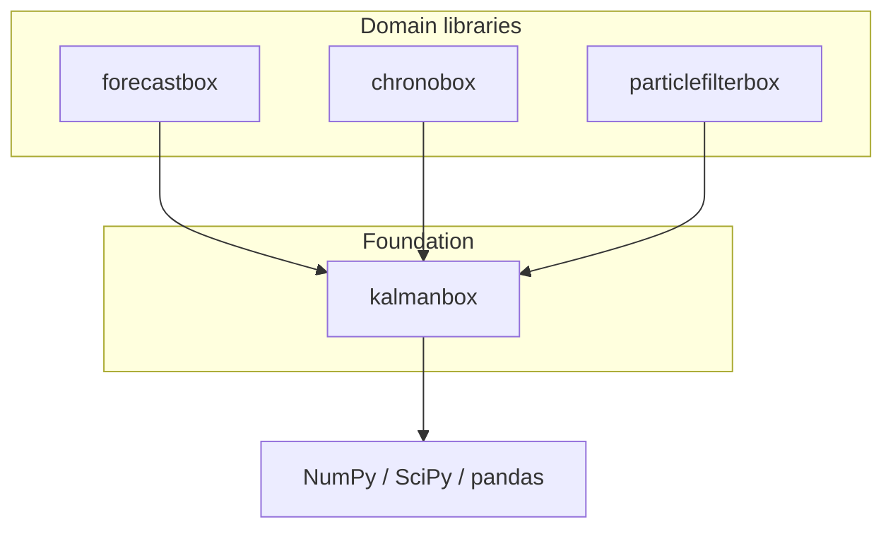

# Ecosystem

`kalmanbox` is the **foundational layer** of the **NodesEcon** scientific
ecosystem. Higher-level libraries do not reimplement Kalman filtering or
state-space machinery — they import it from `kalmanbox`.

## Stack

## What each library provides

=== "kalmanbox"

    **Role**: foundation. Provides the primitives.

    - `KalmanFilter`, `RTSSmoother`, `DisturbanceSmoother`,
      `FixedIntervalSmoother`, `FixedLagSmoother`
    - Alternative filters: `ExtendedKalmanFilter`, `UnscentedKalmanFilter`,
      `SquareRootKalmanFilter`, `InformationFilter`, `EnsembleKalmanFilter`
    - Pre-built models: `LocalLevel`, `LocalLinearTrend`,
      `BasicStructuralModel`, `UnobservedComponents`, `ARIMA_SSM`,
      `DynamicFactorModel`, `TimeVaryingParameters`, `RegressionSSM`,
      `CycleModel`, `CustomStateSpace`
    - Estimation: `MLEstimator`, `EMEstimator`, `BayesianSSM` (Gibbs / FFBS),
      `DiffuseInitialization`
    - Diagnostics, visualisation, reports, CLI

=== "chronobox"

    **Role**: time-series toolbox. Built on top of `kalmanbox`.

    - Calendar arithmetic, frequency conversion, holiday handling
    - Decomposition, trend / seasonal extraction (uses `BSM`, `UCM`)
    - Anomaly detection (uses Kalman residuals)

=== "forecastbox"

    **Role**: forecasting framework. Built on top of `kalmanbox`.

    - Backtesting, model selection, ensembles
    - State-space forecasting models reuse kalmanbox results
    - Hierarchical reconciliation

=== "particlefilterbox"

    **Role**: sequential Monte Carlo. Extends `kalmanbox` to nonlinear /
    non-Gaussian state-space models.

    - Bootstrap filter, auxiliary particle filter, SMC^2
    - Particle Gibbs and Particle MCMC
    - Reuses `kalmanbox` proposals (Kalman / EKF / UKF) where applicable

## Why a foundation library?

!!! ecosystem "Design principle"

    By isolating the Kalman / state-space machinery in `kalmanbox`:

    - Higher libraries stay focused on **their** abstractions.
    - Numerical correctness is centralised — fixes propagate to every
      downstream library.
    - Users of any NodesEcon library can drop down to raw filters when
      they need full control.

## Cross-references

| Topic                     | Where it lives        |
|---------------------------|-----------------------|
| Kalman filter recursion   | `kalmanbox`           |
| Decomposition pipelines   | `chronobox`           |
| Backtesting & ensembles   | `forecastbox`         |
| Particle filters          | `particlefilterbox`   |

If you find yourself reimplementing a Kalman recursion in a downstream
package, that's a signal you should be calling `kalmanbox` instead.
