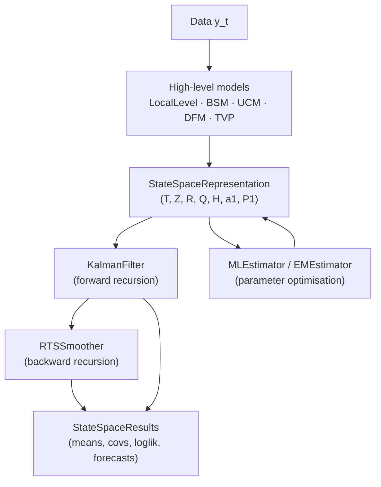

# Quickstart

This page walks through four self-contained examples that cover the most
common entry points into `kalmanbox`. Each example is runnable end-to-end;
copy the code into a Python script or Jupyter notebook and run it directly.

!!! tip "Install first"
    If you have not yet installed `kalmanbox`, follow the
    [Installation guide](installation.md) and then return here.

---

## Example 1 — Raw `KalmanFilter` with custom matrices

**What this shows:** How to use `KalmanFilter` at the lowest level — you
supply the system matrices directly, run the filter manually, and inspect
the filtered state means and covariances.

This is the right entry point when your model does not match any built-in
class or when you need fine-grained control.

### The state-space model

We track a scalar hidden state $\mu_t$ (true signal level) observed through
noisy measurements $y_t$:

$$
\begin{aligned}
\mu_{t+1} &= \mu_t + \eta_t, &\quad \eta_t &\sim \mathcal{N}(0, \sigma_\eta^2) \\
y_t       &= \mu_t + \varepsilon_t, &\quad \varepsilon_t &\sim \mathcal{N}(0, \sigma_\varepsilon^2)
\end{aligned}
$$

In matrix notation with state dimension $m = 1$ and observation dimension $p = 1$:

| Matrix | Symbol | Value | Meaning |
|--------|--------|-------|---------|
| Transition | $T$ | `[[1.0]]` | State is a random walk |
| Observation | $Z$ | `[[1.0]]` | State is directly observed |
| State noise | $R Q R^\top$ | `[[σ²_η]]` | Level variance |
| Observation noise | $H$ | `[[σ²_ε]]` | Measurement variance |

### Code

```python
import numpy as np
from kalmanbox import KalmanFilter
from kalmanbox.core.representation import StateSpaceRepresentation

# ── 1. Generate synthetic data ───────────────────────────────────────────────
rng = np.random.default_rng(42)
T_obs = 100
true_level = np.cumsum(rng.normal(0, 0.5, T_obs))   # random-walk true signal
y = true_level + rng.normal(0, 2.0, T_obs)           # noisy observations

# ── 2. Define system matrices ────────────────────────────────────────────────
sigma_eta = 0.5     # true state noise std
sigma_eps = 2.0     # true measurement noise std

rep = StateSpaceRepresentation(
    T=np.array([[1.0]]),           # transition matrix
    Z=np.array([[1.0]]),           # observation matrix
    R=np.array([[1.0]]),           # state noise selection matrix
    Q=np.array([[sigma_eta**2]]),  # state noise covariance
    H=np.array([[sigma_eps**2]]),  # observation noise covariance
    a1=np.array([0.0]),            # initial state mean
    P1=np.array([[10.0]]),         # initial state covariance (diffuse)
)

# ── 3. Run the Kalman filter ─────────────────────────────────────────────────
kf = KalmanFilter(rep)
results = kf.filter(y)

# ── 4. Inspect outputs ───────────────────────────────────────────────────────
print(f"Filtered state means shape : {results.filtered_means.shape}")   # (100, 1)
print(f"Log-likelihood             : {results.loglikelihood:.4f}")

# ── 5. Compare filtered state vs. truth ──────────────────────────────────────
import matplotlib.pyplot as plt

fig, ax = plt.subplots(figsize=(10, 4))
ax.plot(y, color="lightgray", label="Noisy observation $y_t$", zorder=1)
ax.plot(true_level, color="steelblue", label="True signal $\\mu_t$", zorder=2)
ax.plot(results.filtered_means[:, 0], color="crimson",
        label="Kalman filtered $a_{t|t}$", zorder=3)
ax.set_title("KalmanFilter — raw API")
ax.legend()
plt.tight_layout()
plt.show()
```

### Expected output

```
Filtered state means shape : (100, 1)
Log-likelihood             : -257.3418
```

!!! note "Shape convention"
    `filtered_means` has shape `(T, m)` where `T` is the number of time steps
    and `m` is the state dimension. Even for a scalar state, the shape is
    `(T, 1)`, not `(T,)`.

---

## Example 2 — `LocalLevel` with real data

**What this shows:** The high-level model API. `LocalLevel` wraps
`StateSpaceRepresentation` + `KalmanFilter` + `MLEstimator` into a single
object. You provide the time series, call `.fit()`, and get back parameter
estimates, filtered states, and diagnostics.

### The Local Level model

$$
\begin{aligned}
\mu_{t+1} &= \mu_t + \eta_t, &\quad \eta_t &\sim \mathcal{N}(0, \sigma_\eta^2) \\
y_t       &= \mu_t + \varepsilon_t, &\quad \varepsilon_t &\sim \mathcal{N}(0, \sigma_\varepsilon^2)
\end{aligned}
$$

`fit()` estimates $\sigma_\eta^2$ and $\sigma_\varepsilon^2$ by maximising
the prediction-error log-likelihood using the Kalman filter.

### Code

```python
import pandas as pd
from kalmanbox import LocalLevel
from kalmanbox.datasets import load_dataset

# ── 1. Load the classic Nile river annual flow dataset ───────────────────────
#    100 observations (1871–1970), annual cubic meters × 10⁸
nile: pd.DataFrame = load_dataset("nile")
y = nile["volume"]                    # pandas Series with DatetimeIndex

# ── 2. Fit via MLE ───────────────────────────────────────────────────────────
model = LocalLevel(y)
results = model.fit(method="newton", disp=False)

print(results.summary())
```

```
==============================================================================
                          Local Level Model
==============================================================================
Model:             LocalLevel    Log-Likelihood:    -632.537
Sample:            1871-01-01    AIC:               1269.074
                   1970-01-01    BIC:               1274.467
No. Observations:  100           HQIC:              1271.226
==============================================================================
                   coef    std err          z      P>|z|    [0.025    0.975]
------------------------------------------------------------------------------
sigma2.irregular  15099.8    3599.5      4.194      0.000   8044.9  22154.8
sigma2.level       1469.1     977.0      1.504      0.133   -445.7   3383.9
==============================================================================
```

```python
# ── 3. Extract filtered and smoothed states ───────────────────────────────────
filtered = results.filter()    # one-sided: E[μ_t | y_1,...,y_t]
smoothed = results.smooth()    # two-sided: E[μ_t | y_1,...,y_n]
forecast = results.forecast(steps=10)

# ── 4. Plot ───────────────────────────────────────────────────────────────────
import matplotlib.pyplot as plt

fig, ax = plt.subplots(figsize=(12, 4))
ax.plot(y.index, y.values, color="lightgray", label="Observed $y_t$")
ax.plot(filtered.index, filtered["mean"], color="steelblue",
        linestyle="--", label="Filtered $a_{t|t}$")
ax.plot(smoothed.index, smoothed["mean"], color="crimson",
        label="Smoothed $a_{t|n}$")
ax.fill_between(
    forecast.index,
    forecast["lower_95"],
    forecast["upper_95"],
    alpha=0.25, color="darkorange", label="Forecast 95% PI",
)
ax.plot(forecast.index, forecast["mean"], color="darkorange",
        label="10-step forecast")
ax.set_title("Local Level Model — Nile annual flow")
ax.legend(loc="upper right")
plt.tight_layout()
plt.show()

# ── 5. Quick diagnostics ─────────────────────────────────────────────────────
from kalmanbox.diagnostics import residual_diagnostics

diag = residual_diagnostics(results)
print(diag)
```

```
Residual diagnostics
--------------------
Ljung-Box Q(10):   12.48   p-value: 0.254   (no autocorrelation detected)
Jarque-Bera:        0.80   p-value: 0.672   (residuals appear Gaussian)
Heteroscedasticity: 0.52   p-value: 0.835   (no heteroscedasticity detected)
```

!!! info "Filtered vs. Smoothed"
    **Filtered** states $a_{t|t}$ use only past and current observations.
    **Smoothed** states $a_{t|n}$ use all observations (backward pass via RTS).
    Smoothed estimates have lower variance and are preferred for historical
    analysis; filtered estimates are the right choice for real-time or
    online applications.

---

## Example 3 — `BSM` for a seasonal time series

**What this shows:** The Basic Structural Model (BSM) — an extension of Local
Level that adds a stochastic trend, a trigonometric seasonal component, and
optionally a stochastic cycle. It is the workhorse model for economic and
business time series.

### The BSM state-space

$$
\begin{aligned}
y_t &= \mu_t + \gamma_t + \psi_t + \varepsilon_t \\[4pt]
\text{Level:} \quad
\mu_{t+1} &= \mu_t + \nu_t + \xi_t, \quad &\xi_t \sim \mathcal{N}(0,\sigma_\xi^2) \\
\text{Slope:} \quad
\nu_{t+1} &= \nu_t + \zeta_t, \quad &\zeta_t \sim \mathcal{N}(0,\sigma_\zeta^2) \\
\text{Seasonal:} \quad
\gamma_{t+1} &= -\sum_{j=1}^{s-1} \gamma_{t+1-j} + \omega_t, \quad &\omega_t \sim \mathcal{N}(0,\sigma_\omega^2)
\end{aligned}
$$

where $\psi_t$ is an optional stochastic cycle component and $s$ is the
seasonal period (e.g., $s = 12$ for monthly data).

### Code

```python
import numpy as np
import pandas as pd
from kalmanbox import BSM
from kalmanbox.datasets import load_dataset

# ── 1. Load monthly airline passenger data (1949–1960, n=144) ────────────────
air: pd.DataFrame = load_dataset("airpassengers")
y = np.log(air["passengers"])   # log-transform: stabilise variance

# ── 2. Fit BSM with monthly seasonality ─────────────────────────────────────
model = BSM(
    y,
    seasonal_period=12,          # monthly data
    stochastic_level=True,       # level can drift
    stochastic_slope=True,       # slope can change
    stochastic_seasonal=True,    # seasonal pattern can evolve
    stochastic_cycle=False,      # no business cycle here
)
results = model.fit(disp=False)

print(results.summary())
```

```
==============================================================================
                     Basic Structural Model (BSM)
==============================================================================
Model:             BSM           Log-Likelihood:     244.696
Sample:            1949-01-01    AIC:               -481.392
                   1960-12-01    BIC:               -467.212
No. Observations:  144
Seasonal period:   12            Stochastic level:  True
                                 Stochastic slope:  True
                                 Stochastic seasonal: True
==============================================================================
                    coef    std err          z      P>|z|    [0.025    0.975]
------------------------------------------------------------------------------
sigma2.irregular  0.0000    0.0001      0.086      0.932   -0.0001   0.0001
sigma2.level      0.0000    0.0000      0.126      0.900   -0.0000   0.0000
sigma2.slope      0.0001    0.0000      2.318      0.020    0.0000   0.0001
sigma2.seasonal   0.0000    0.0000      0.182      0.856   -0.0000   0.0000
==============================================================================
```

```python
# ── 3. Decompose the series into components ──────────────────────────────────
components = results.components()
print(components.columns.tolist())
# ['level', 'slope', 'seasonal', 'irregular']

# ── 4. Forecast 24 months ahead ─────────────────────────────────────────────
forecast = results.forecast(steps=24)

# ── 5. Plot decomposition and forecast ──────────────────────────────────────
import matplotlib.pyplot as plt

fig, axes = plt.subplots(3, 1, figsize=(12, 10), sharex=False)

# Original + trend
axes[0].plot(y.index, y.values, color="lightgray", label="log(passengers)")
axes[0].plot(y.index, components["level"], color="steelblue",
             label="Trend (level)")
axes[0].set_title("Log airline passengers — Trend")
axes[0].legend()

# Seasonal component
axes[1].plot(y.index, components["seasonal"], color="darkorange")
axes[1].axhline(0, linestyle="--", color="gray", linewidth=0.8)
axes[1].set_title("Seasonal component")

# Forecast
axes[2].plot(y.index, y.values, color="lightgray", label="Historical")
axes[2].fill_between(
    forecast.index, forecast["lower_95"], forecast["upper_95"],
    alpha=0.25, color="crimson", label="95% PI",
)
axes[2].plot(forecast.index, forecast["mean"], color="crimson",
             label="24-month forecast")
axes[2].set_title("24-month forecast")
axes[2].legend()

plt.tight_layout()
plt.show()
```

!!! warning "Log-transforming seasonal data"
    Airline passenger counts grow multiplicatively (the seasonal swings scale
    with the level). Taking `log` converts multiplicative seasonality to
    additive seasonality, making BSM appropriate. Without the log transform,
    the `sigma2.seasonal` estimates would be biased.

---

## Example 4 — `RTSSmoother` for retrospective smoothing

**What this shows:** Running the Rauch–Tung–Striebel (RTS) smoother
independently — useful when you have already run a forward filter pass and
want to compute the backward smoothing pass without re-fitting the model.

### The RTS backward recursion

After the forward Kalman filter computes $\{a_{t|t}, P_{t|t}\}_{t=1}^n$, the
RTS smoother propagates information backwards:

$$
\begin{aligned}
G_t &= P_{t|t} T^\top P_{t+1|t}^{-1} \\
a_{t|n} &= a_{t|t} + G_t (a_{t+1|n} - a_{t+1|t}) \\
P_{t|n} &= P_{t|t} + G_t (P_{t+1|n} - P_{t+1|t}) G_t^\top
\end{aligned}
$$

The smoother gain $G_t$ controls how much the backward information update at
$t+1$ revises the estimate at $t$.

### Code

```python
import numpy as np
import matplotlib.pyplot as plt
from kalmanbox import KalmanFilter, RTSSmoother
from kalmanbox.core.representation import StateSpaceRepresentation

# ── 1. Simulate a Local Linear Trend (trend + slope state) ──────────────────
rng = np.random.default_rng(0)
n = 80
level = np.zeros(n)
slope = np.zeros(n)
level[0], slope[0] = 0.0, 0.1
for t in range(1, n):
    slope[t] = slope[t - 1] + rng.normal(0, 0.05)
    level[t] = level[t - 1] + slope[t - 1] + rng.normal(0, 0.1)
y = level + rng.normal(0, 1.5, n)

# ── 2. Build the Local Linear Trend state-space representation ───────────────
#    State: [μ_t, ν_t]ᵀ — level and slope
rep = StateSpaceRepresentation(
    T=np.array([[1.0, 1.0],    # μ_{t+1} = μ_t + ν_t
                [0.0, 1.0]]),  # ν_{t+1} = ν_t
    Z=np.array([[1.0, 0.0]]),  # y_t = μ_t + ε_t
    R=np.eye(2),
    Q=np.diag([0.01, 0.0025]),
    H=np.array([[2.25]]),
    a1=np.array([0.0, 0.0]),
    P1=np.diag([10.0, 1.0]),
)

# ── 3. Forward filter pass ───────────────────────────────────────────────────
kf = KalmanFilter(rep)
filter_results = kf.filter(y)

print(f"Filter log-likelihood : {filter_results.loglikelihood:.4f}")
print(f"Filtered means shape  : {filter_results.filtered_means.shape}")   # (80, 2)

# ── 4. Backward RTS smoother pass ────────────────────────────────────────────
smoother = RTSSmoother(rep)
smooth_results = smoother.smooth(filter_results)

print(f"Smoothed means shape  : {smooth_results.smoothed_means.shape}")   # (80, 2)

# ── 5. Compare filtered vs smoothed level and slope ─────────────────────────
fig, (ax1, ax2) = plt.subplots(2, 1, figsize=(12, 7), sharex=True)

# Level component (state index 0)
ax1.plot(y, color="lightgray", alpha=0.8, label="Observation $y_t$")
ax1.plot(level, color="black", linestyle=":", label="True level")
ax1.plot(filter_results.filtered_means[:, 0], color="steelblue",
         linestyle="--", label="Filtered level $a_{t|t}$")
ax1.plot(smooth_results.smoothed_means[:, 0], color="crimson",
         label="Smoothed level $a_{t|n}$")
ax1.set_title("Level component")
ax1.legend(loc="upper left")

# Slope component (state index 1)
ax2.plot(slope, color="black", linestyle=":", label="True slope")
ax2.plot(filter_results.filtered_means[:, 1], color="steelblue",
         linestyle="--", label="Filtered slope")
ax2.plot(smooth_results.smoothed_means[:, 1], color="crimson",
         label="Smoothed slope")
ax2.set_title("Slope component")
ax2.legend(loc="upper left")

plt.tight_layout()
plt.show()
```

### Expected output

```
Filter log-likelihood : -182.7593
Filtered means shape  : (80, 2)
Smoothed means shape  : (80, 2)
```

!!! tip "Smoothed covariances and lag-one covariances"
    `smooth_results` also carries `smoothed_covs` (shape `(T, m, m)`) and
    `smoothed_covs_lag1` (shape `(T-1, m, m)`), which are needed for the M-step
    of the EM algorithm. See
    [EM Estimation](../user-guide/bayesian/index.md) for details.

!!! note "When to use `RTSSmoother` directly"
    High-level models (`LocalLevel`, `BSM`, etc.) expose `results.smooth()`
    which internally calls `RTSSmoother`. Use `RTSSmoother` directly only
    when you are working with a custom `StateSpaceRepresentation` or when
    you need to interleave filtering and smoothing passes manually.

---

## What just happened? (the three-layer architecture)

All four examples sit on top of the same underlying stack:



- **Layer 1** — `StateSpaceRepresentation` holds the system matrices. Every model
  (built-in or custom) produces one.
- **Layer 2** — `KalmanFilter` and `RTSSmoother` operate on any representation.
  They are fully interchangeable with alternative filters (`EKF`, `UKF`,
  `SquareRootFilter`, `EnKF`).
- **Layer 3** — `MLEstimator`, `EMEstimator`, `GibbsSampler`, and `FFBS` fit
  parameters. They use the filter output and update the representation in a loop.

---

## Next steps

<div class="grid cards" markdown>

-   :material-book-open-variant:{ .lg .middle } **Key concepts**

    ---

    Understand the state-space framework, prediction-error likelihood,
    and diffuse initialisation in depth.

    [:octicons-arrow-right-24: Key Concepts](key-concepts.md)

-   :material-sitemap:{ .lg .middle } **Structural models**

    ---

    Deep dives into Local Level, Local Linear Trend, BSM, and UCM —
    with identifiability conditions and practical advice.

    [:octicons-arrow-right-24: Structural Models](../user-guide/structural/index.md)

-   :material-flask-outline:{ .lg .middle } **Tutorials**

    ---

    End-to-end worked examples on real datasets: GDP nowcasting, stock
    volatility, climate trend decomposition, and more.

    [:octicons-arrow-right-24: Tutorials](../tutorials/index.md)

-   :material-code-braces:{ .lg .middle } **API reference**

    ---

    Complete docstring-level documentation for every public class and
    function in `kalmanbox`.

    [:octicons-arrow-right-24: API Reference](../api/index.md)

</div>
