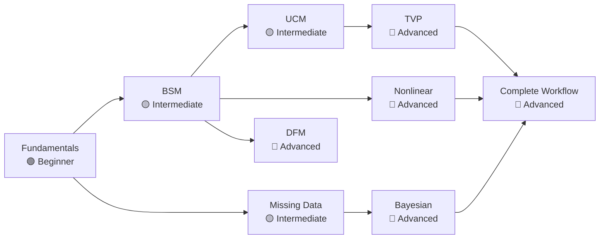

# Tutorials

Tutorials are step-by-step guided examples. Each one uses a real or
realistic dataset, walks through every line of code, and explains *why*
each step is taken — not just what the code does. They complement the
[User Guide](../user-guide/index.md) (which focuses on API depth) and the
[Theory](../theory/index.md) pages (which focus on mathematics).

!!! tip "How to use these tutorials"
    Run the code interactively in a Jupyter notebook. Each tutorial is
    self-contained — copy the entire code block, paste it into a cell, and
    execute. Expected outputs are shown so you can verify correctness.

---

## Learning path

Start at **Fundamentals** and follow the arrows. Each tutorial assumes you
have completed the ones pointing to it.

---

## Tutorials overview

-   :material-numeric-1-circle:{ .lg .middle } **Fundamentals**

    ---

    :material-signal:{ .middle } **Beginner** · ~45 min

    Learn the Kalman Filter from scratch using synthetic data. Covers the
    state-space representation, forward filtering, RTS smoothing, MLE
    parameter estimation, and basic diagnostics — all in one place.

    **You will learn:**

    - Building a `StateSpaceRepresentation` manually
    - Running `KalmanFilter` and `RTSSmoother`
    - Estimating parameters with `MLEstimator`
    - Interpreting filtered vs. smoothed states
    - Running residual diagnostics

    [:octicons-arrow-right-24: Start Fundamentals](fundamentals.md)

-   :material-numeric-2-circle:{ .lg .middle } **BSM: Structural Decomposition**

    ---

    :material-signal:{ .middle } **Intermediate** · ~60 min

    Decompose a real economic time series into trend, seasonal, and irregular
    components using the Basic Structural Model (BSM). Includes MLE
    estimation, component plots, residual diagnostics, and a 24-step
    forecast compared against classical STL decomposition.

    **You will learn:**

    - Configuring `BSM` with stochastic components
    - Extracting and plotting decomposed components
    - Forecasting with prediction intervals
    - Comparing BSM vs. STL decomposition

    [:octicons-arrow-right-24: Start BSM Tutorial](bsm.md)

-   :material-numeric-3-circle:{ .lg .middle } **UCM: Custom Components**

    ---

    :material-signal:{ .middle } **Intermediate** · ~60 min

    Build a flexible Unobserved Components Model (UCM) with trend, stochastic
    cycle, and seasonality. Explore component-by-component analysis and
    compare UCM against BSM to understand when each model is appropriate.

    **You will learn:**

    - Configuring `UCM` with a stochastic cycle
    - Adding and removing individual components
    - Comparing UCM vs. BSM on the same dataset
    - Interpreting cycle frequency and damping

    [:octicons-arrow-right-24: Start UCM Tutorial](ucm.md)

-   :material-numeric-4-circle:{ .lg .middle } **Missing Data**

    ---

    :material-signal:{ .middle } **Intermediate** · ~45 min

    Handle irregularly-spaced observations, block-missing episodes, and
    mixed-frequency data using the built-in missing-data support in
    `KalmanFilter`. Includes imputation, uncertainty quantification, and
    practical strategies for real-world gaps.

    **You will learn:**

    - Encoding missing observations with `np.nan`
    - How the Kalman filter skips the update step for `NaN`
    - Imputing values with smoothed states and their uncertainty
    - Mixed-frequency modelling with a stock-flow aggregation matrix

    [:octicons-arrow-right-24: Missing Data Guide](../user-guide/kalman/missing-data.md)

-   :material-numeric-5-circle:{ .lg .middle } **DFM: Dynamic Factor Model**

    ---

    :material-signal:{ .middle } **Advanced** · ~75 min

    Extract latent common factors from a panel of macroeconomic indicators
    using a Dynamic Factor Model (DFM). Applications include coincident
    economic indexes, business cycle dating, and nowcasting GDP.

    **You will learn:**

    - Specifying `DFM` with multiple series and factors
    - Identifying factor loadings and dynamic structure
    - Computing factor scores and variance decomposition
    - Nowcasting with partially released data

    [:octicons-arrow-right-24: US Macro DFM Tutorial](us-macro-dfm.md)

-   :material-numeric-6-circle:{ .lg .middle } **TVP: Time-Varying Parameters**

    ---

    :material-signal:{ .middle } **Advanced** · ~60 min

    Estimate a regression model whose coefficients evolve through time using
    `TVP`. Classic application: time-varying CAPM beta for a stock. Covers
    stability analysis, rolling vs. smoothed coefficients, and structural
    break detection.

    **You will learn:**

    - Setting up `TVP` for a regression with drifting coefficients
    - Interpreting time-varying coefficients with credible bands
    - Detecting structural breaks from smoothed states
    - Comparing TVP vs. rolling OLS

    [:octicons-arrow-right-24: TVP CAPM Tutorial](tvp-capm.md)

-   :material-numeric-7-circle:{ .lg .middle } **Nonlinear Filtering**

    ---

    :material-signal:{ .middle } **Advanced** · ~75 min

    Apply EKF and UKF to track nonlinear systems — a 2-D ballistic
    trajectory and a stochastic volatility model. Understand when linear
    approximations break down and how sigma-point methods improve accuracy.

    **You will learn:**

    - Implementing Jacobians for `EKF`
    - Configuring sigma points and weights for `UKF`
    - Comparing EKF vs. UKF accuracy and computational cost
    - Fitting a stochastic volatility model via nonlinear SSM

    [:octicons-arrow-right-24: Nonlinear Tracking Tutorial](nonlinear-tracking.md)

-   :material-numeric-8-circle:{ .lg .middle } **Bayesian Estimation**

    ---

    :material-signal:{ .middle } **Advanced** · ~90 min

    Estimate state-space model parameters using Markov Chain Monte Carlo
    (MCMC). Covers Gibbs sampling with Forward-Filter Backward-Sample (FFBS),
    conjugate priors, posterior diagnostics, and comparison with MLE.

    **You will learn:**

    - Specifying inverse-Gamma priors for variance parameters
    - Running `GibbsSampler` with `FFBS` for state and parameter draws
    - Diagnosing MCMC convergence (R-hat, ESS, trace plots)
    - Comparing posterior distributions vs. MLE confidence intervals

    [:octicons-arrow-right-24: Bayesian Estimation Walkthrough](bayesian-walkthrough.md)

-   :material-numeric-9-circle:{ .lg .middle } **Complete Workflow**

    ---

    :material-signal:{ .middle } **Advanced** · ~120 min

    A full end-to-end pipeline: load data, explore, specify competing models,
    estimate, diagnose, select via information criteria, forecast, and
    report. Uses the `ExperimentFramework` to organise reproducible
    comparisons across models and filters.

    **You will learn:**

    - Organising a model comparison experiment with `ExperimentFramework`
    - Systematic diagnostics and information criteria across models
    - Report generation with `kalmanbox.reports`
    - CLI usage for batch runs

    [:octicons-arrow-right-24: Experiment Framework Guide](../user-guide/experiment.md)

---

## Difficulty levels

| Level | Prerequisite | Topics covered |
|-------|-------------|----------------|
| :material-signal: **Beginner** | Basic Python, NumPy | KF, RTS, MLE, diagnostics |
| :material-signal: **Intermediate** | Beginner tutorials | BSM, UCM, missing data |
| :material-signal: **Advanced** | Intermediate tutorials | DFM, TVP, EKF/UKF, MCMC |

---

## Datasets used

| Tutorial | Dataset | Source | $n$ | Frequency |
|----------|---------|--------|-----|-----------|
| Fundamentals | Synthetic random walk + noise | Generated | 200 | — |
| BSM | International airline passengers | Box & Jenkins (1976) | 144 | Monthly |
| UCM | US Industrial Production Index | FRED | 300 | Monthly |
| DFM | US macroeconomic panel | FRED-MD | 128 × 20 | Monthly |
| TVP | S&P 500 vs. sector ETF | Yahoo Finance | 252 | Daily |
| Nonlinear | Simulated trajectory + SV | Generated | 500 | — |
| Bayesian | Nile annual flow | Durbin & Koopman | 100 | Annual |

---

## Quick reference: which tutorial to choose

=== "I want to understand the Kalman Filter"

    Start with [Fundamentals](fundamentals.md). It covers the mathematics
    intuitively, builds the model from scratch, and explains every parameter.

=== "I have a seasonal time series to decompose"

    Go to [BSM](bsm.md). The Basic Structural Model is the standard workhorse
    for trend-seasonal decomposition in economics and business.

=== "I need a cycle component or non-standard structure"

    Go to [UCM](ucm.md). UCM lets you freely combine level, slope, cycle, and
    seasonal components and is more flexible than BSM.

=== "I have a panel of related series"

    Go to [DFM](us-macro-dfm.md). Dynamic Factor Models extract common factors
    from multiple co-moving series, ideal for macroeconomic panels.

=== "My regression coefficients might change over time"

    Go to [TVP](tvp-capm.md). Time-Varying Parameter models give every
    coefficient its own Kalman filter trajectory.

=== "My model is nonlinear"

    Go to [Nonlinear](nonlinear-tracking.md). EKF and UKF extend the Kalman
    filter to nonlinear state-transition and observation functions.

=== "I want full uncertainty quantification (Bayesian)"

    Go to [Bayesian](bayesian-walkthrough.md). Gibbs + FFBS gives posterior
    distributions over all parameters and states simultaneously.

---

## Conventions used in all tutorials

- Code blocks are **fully executable** — copy and paste into a script or notebook.
- Random seeds are fixed (`np.random.default_rng(seed)`) for reproducibility.
- Plots use matplotlib with the `seaborn-v0_8-whitegrid` style where indicated.
- Expected console output is shown after each major step.
- Links to the relevant [User Guide](../user-guide/index.md) and
  [Theory](../theory/index.md) pages are provided for deeper reading.

---

## See also

- [User Guide](../user-guide/index.md) — reference documentation for every class and method
- [Theory](../theory/index.md) — mathematical derivations and proofs
- [Diagnostics](../diagnostics/index.md) — model checking and validation
- [API Reference](../api/index.md) — full docstring-level API
- [Getting Started](../getting-started/index.md) — installation and quickstart
