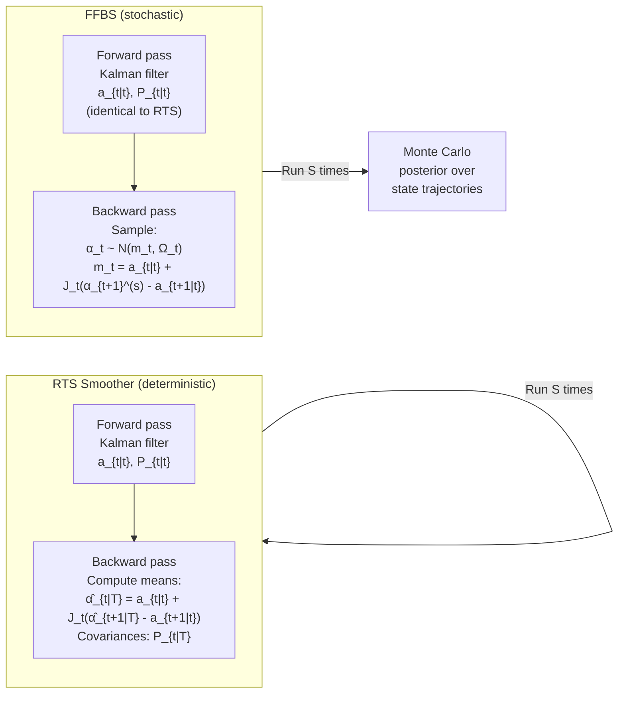

# Forward Filtering Backward Sampling (FFBS)

**Forward Filtering Backward Sampling (FFBS)** is the algorithm that draws an entire state
trajectory $\alpha_{1:T} = (\alpha_1, \ldots, \alpha_T)$ as a single exact sample from the
joint conditional posterior:

$$
p(\alpha_{1:T} \mid y_{1:T}, \theta)
$$

in a linear Gaussian state-space model. It is the **state sampling block** of the Gibbs sampler
(see [Gibbs Sampling](gibbs.md)) and is an *exact* sampler — no Metropolis–Hastings acceptance
step is needed.

!!! abstract "FFBS vs RTS Smoother"
    Both FFBS and the [RTS Smoother](../kalman/rts-smoother.md) use the same forward Kalman pass
    and the same backward-smoothing gains $J_t$. The difference is:

    | | RTS Smoother | FFBS |
    |---|---|---|
    | **Output** | Conditional mean $\hat\alpha_{t\|T}$ and covariance $P_{t\|T}$ | A random draw from $p(\alpha_{1:T} \mid y, \theta)$ |
    | **Purpose** | Point estimate of hidden states | Monte Carlo sampling of state trajectories |
    | **Use case** | MLE, EM algorithm | Bayesian Gibbs sampler |
    | **Number of passes** | 1 forward + 1 backward (deterministic) | 1 forward + 1 backward (stochastic) |

    The RTS smoother computes the *mean* of the smoothing distribution. FFBS draws a *sample*
    from the same distribution. With many FFBS draws, the sample mean converges to the RTS
    smoother mean.

---

## 1. The joint smoothing distribution

The joint distribution of all states given observations factors by the **Markov property** of
the SSM:

$$
p(\alpha_{1:T} \mid y_{1:T}, \theta)
= p(\alpha_T \mid y_{1:T}, \theta)
  \prod_{t=1}^{T-1} p(\alpha_t \mid \alpha_{t+1}, y_{1:t}, \theta)
$$

Each factor on the right is Gaussian because the SSM is linear Gaussian. Specifically:

$$
\alpha_t \mid \alpha_{t+1}, y_{1:t}, \theta
\sim \mathcal{N}\!\left(m_t(\alpha_{t+1}),\; \Omega_t\right)
$$

with parameters derived from the Kalman filter output.

---

## 2. Forward pass: Kalman filtering

The forward pass runs the standard Kalman filter, collecting at each time $t$:

- **Filtered mean:** $a_{t|t} = E[\alpha_t \mid y_{1:t}, \theta]$
- **Filtered covariance:** $P_{t|t} = \text{Var}[\alpha_t \mid y_{1:t}, \theta]$
- **Predicted mean:** $a_{t+1|t} = T\,a_{t|t}$
- **Predicted covariance:** $P_{t+1|t} = T\,P_{t|t}\,T' + R\,Q\,R'$

The terminal filtered distribution is:

$$
\alpha_T \mid y_{1:T}, \theta \sim \mathcal{N}\!\left(a_{T|T},\; P_{T|T}\right)
$$

This is the starting point for the backward pass.

---

## 3. Backward pass: sampling the trajectory

The backward sampling pass proceeds from $t = T$ down to $t = 1$.

### Step 1: Sample the terminal state

$$
\alpha_T^{(s)} \sim \mathcal{N}\!\left(a_{T|T},\; P_{T|T}\right)
$$

### Step 2: For $t = T-1, T-2, \ldots, 1$ in reverse:

Compute the **backward smoothing gain** (identical to the RTS smoother gain):

$$
J_t = P_{t|t}\, T'\, P_{t+1|t}^{-1}
$$

The conditional distribution of $\alpha_t$ given $\alpha_{t+1}^{(s)}$ and $y_{1:t}$ is:

$$
\alpha_t \mid \alpha_{t+1}^{(s)}, y_{1:t}, \theta
\sim \mathcal{N}\!\left(m_t,\; \Omega_t\right)
$$

with:

$$
\boxed{
m_t     = a_{t|t} + J_t\!\left(\alpha_{t+1}^{(s)} - a_{t+1|t}\right),
\qquad
\Omega_t = P_{t|t} - J_t\, P_{t+1|t}\, J_t'
}
$$

Draw:

$$
\alpha_t^{(s)} \sim \mathcal{N}(m_t,\; \Omega_t)
$$

This draw uses the **correction** $\alpha_{t+1}^{(s)} - a_{t+1|t}$: the discrepancy between the
previously sampled future state and its predicted value, propagated backward through $J_t$.

### Why this is exact

The backward conditional $\mathcal{N}(m_t, \Omega_t)$ is the *exact* distribution implied by the
Markov factorisation. No approximation is made: the algorithm samples from the true joint
smoothing distribution $p(\alpha_{1:T} \mid y_{1:T}, \theta)$.

---

## 4. Complete FFBS algorithm

```
Input:  observations y₁:T, SSM matrices (T, Z, R, Q, H, a₀, P₀)
Output: one draw α₁:T ~ p(α₁:T | y₁:T, θ)

Forward pass (Kalman filter):
    For t = 1 to T:
        Predict: a_{t|t-1} = T a_{t-1|t-1}
                 P_{t|t-1} = T P_{t-1|t-1} T' + R Q R'
        Update:  v_t        = y_t - Z a_{t|t-1}
                 F_t        = Z P_{t|t-1} Z' + H
                 K_t        = P_{t|t-1} Z' F_t⁻¹
                 a_{t|t}    = a_{t|t-1} + K_t v_t
                 P_{t|t}    = (I - K_t Z) P_{t|t-1}
        Store: {a_{t|t}, P_{t|t}, a_{t+1|t}, P_{t+1|t}}

Backward sampling pass:
    Draw αT ~ N(a_{T|T}, P_{T|T})
    For t = T-1 down to 1:
        J_t      = P_{t|t} T' P_{t+1|t}⁻¹
        m_t      = a_{t|t} + J_t (α_{t+1} - a_{t+1|t})
        Ω_t      = P_{t|t} - J_t P_{t+1|t} J_t'
        Draw αt ~ N(m_t, Ω_t)

Return: (α₁, α₂, ..., αT)
```

---

## 5. FFBS vs RTS Smoother: detailed comparison



The key distinction is in the backward pass:

| | RTS | FFBS |
|---|---|---|
| Uses $\alpha_{t+1}^{(s)}$ (random sample) | No — uses smoother mean $\hat\alpha_{t+1\|T}$ | Yes |
| $\Omega_t$ | Full smoothing covariance $P_{t\|T}$ | Same expression, used as draw variance |
| Output | One deterministic trajectory (the posterior mean) | One random trajectory from the posterior |

---

## 6. Multiple trajectory sampling

Drawing $S$ independent state trajectories provides a Monte Carlo approximation to any
functional of the smoothing distribution:

$$
E[g(\alpha_{1:T}) \mid y_{1:T}]
\approx \frac{1}{S} \sum_{s=1}^{S} g(\alpha_{1:T}^{(s)})
$$

```python
from kalmanbox.bayesian import FFBS
from kalmanbox.structural import LocalLevel
import numpy as np

np.random.seed(42)
T = 200
y = np.cumsum(np.random.randn(T) * 0.3) + np.random.randn(T) * 0.5

model = LocalLevel(sigma2_obs=0.5, sigma2_level=0.1)

ffbs = FFBS(model)
filter_output = ffbs.forward_filter(y)

# Draw S independent state trajectories
S = 1000
trajectories = ffbs.sample_states(filter_output, n_draws=S)   # shape (S, T)

# Posterior mean and pointwise credible interval
alpha_mean = trajectories.mean(axis=0)                         # shape (T,)
alpha_ci   = np.quantile(trajectories, [0.025, 0.975], axis=0) # shape (2, T)

# Posterior probability that level exceeds zero at each time step
prob_positive = (trajectories > 0).mean(axis=0)               # shape (T,)
```

---

## 7. Computational complexity

Each FFBS call runs one forward Kalman filter pass and one backward sampling pass:

| Phase | Operations | Cost |
|-------|-----------|------|
| Forward filter | $T$ predict-update steps | $O(Tk^3 + Tkp)$ |
| Backward sample | $T$ Gaussian draws from $\mathcal{N}(m_t, \Omega_t)$ | $O(Tk^3)$ |
| **Total per draw** | — | $O(Tk^3)$ |
| $S$ draws | — | $O(STk^3)$ |

Here $k$ = state dimension, $p$ = observation dimension. For the Local Level model ($k = 1$),
the cost is $O(ST)$ — extremely fast even for $S = 10\,000$ and $T = 1\,000$.

The forward filter is shared across Gibbs iterations at fixed $\theta$; only the backward
pass changes. Some implementations cache the filter output and re-run only the backward sample
when $\theta$ is unchanged.

---

## 8. Numerical implementation

### 8.1 Stable Cholesky draws

Rather than computing $L = \text{chol}(\Omega_t)$ and drawing $\alpha_t = m_t + L\,z$ with
$z \sim \mathcal{N}(0, I)$, the Square-Root FFBS maintains $\Omega_t$ in factored form
throughout the backward pass — preventing the covariance from losing positive-definiteness
when $\Omega_t$ is nearly singular.

```python
ffbs = FFBS(model, precision="square_root")   # uses Square-Root covariance form
```

### 8.2 Missing observations

When $y_t$ is missing, the Kalman update step is skipped: $a_{t|t} = a_{t|t-1}$ and
$P_{t|t} = P_{t|t-1}$. The FFBS backward pass proceeds unchanged — missing observations
simply leave the filtered distribution uninformative at that step, and the state draw
relies entirely on the smoothing structure from adjacent time steps.

---

## 9. Direct FFBS API

The `FFBS` class can be used independently of the `GibbsSampler`:

```python
from kalmanbox.bayesian import FFBS

# Build with an explicit SSM specification
import numpy as np

T_mat = np.array([[1.0]])    # local level
Z_mat = np.array([[1.0]])
R_mat = np.array([[1.0]])
Q_mat = np.array([[0.1]])
H_mat = np.array([[0.5]])
a0    = np.array([0.0])
P0    = np.array([[10.0]])

ffbs = FFBS.from_matrices(T=T_mat, Z=Z_mat, R=R_mat, Q=Q_mat, H=H_mat, a0=a0, P0=P0)

# Forward filter (shared across draws at fixed θ)
filter_out = ffbs.forward_filter(y)

# Draw a single trajectory
alpha_draw = ffbs.sample_states(filter_out, n_draws=1).squeeze()   # shape (T,)

# Draw multiple trajectories efficiently
alpha_draws = ffbs.sample_states(filter_out, n_draws=500)           # shape (500, T)
```

---

## Further reading

| Topic | Page |
|-------|------|
| RTS Smoother — deterministic counterpart | [RTS Smoother](../kalman/rts-smoother.md) |
| Gibbs Sampling — wraps FFBS in parameter sweep | [Gibbs Sampling](gibbs.md) |
| Square-Root filter for numerical stability | [Square-Root Filter](../filters/square-root.md) |
| Missing data handling | [Missing Data](../kalman/missing-data.md) |
| Posterior diagnostics for FFBS-based chains | [Posterior Diagnostics](posterior-diagnostics.md) |
| API reference — FFBS | [api/bayesian](../../api/bayesian.md) |
