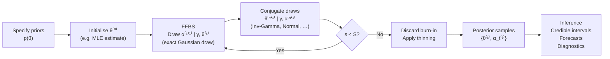

# Bayesian Estimation

Kalman filtering gives optimal state estimates for a **fixed, known** parameter vector $\theta$.
In practice $\theta$ is unknown. Classical MLE treats $\theta$ as a fixed constant and maximises
the log-likelihood — computationally convenient but with two structural limitations:

1. **No parameter uncertainty** — point estimates ignore the fact that data are often insufficient
   to identify all parameters precisely. Confidence intervals require asymptotic approximations
   that can fail with short samples or near-unidentified models.
2. **No regularisation by default** — MLE in high-dimensional models (DFM, TVP) overfits without
   explicit penalty terms. Priors incorporate structure naturally.

Bayesian estimation treats both the **hidden states** $\{\alpha_t\}$ and the **parameters**
$\theta$ as random variables and produces a full joint posterior:

$$
p\!\left(\theta, \{\alpha_t\}_{t=1}^T \mid y_{1:T}\right)
\;\propto\;
p(\theta)\;
p(\alpha_0)\;
\prod_{t=1}^{T} p(y_t \mid \alpha_t, \theta)\;
p(\alpha_{t} \mid \alpha_{t-1}, \theta)
$$

This single distribution encodes all inferential uncertainty — parameter uncertainty, state
uncertainty, and the correlation between the two — within a coherent probabilistic framework.

!!! abstract "What you will find in this section"
    - A conceptual comparison of Bayesian vs MLE approaches for state-space models
    - The Gibbs sampling algorithm for MCMC inference over parameters
    - Forward Filtering Backward Sampling (FFBS) for drawing exact state trajectories
    - How to specify conjugate and weakly informative priors for structural models
    - MCMC convergence diagnostics: R-hat, ESS, trace plots, Geweke test, posterior predictive checks

---

## Why Bayesian estimation?

### Full uncertainty quantification

MLE returns a single point estimate $\hat{\theta}$. Bayesian estimation returns a **posterior
distribution** $p(\theta \mid y_{1:T})$. From this distribution you can compute:

- **Posterior means / medians** — Bayes-optimal point estimates under squared and absolute loss
- **Credible intervals** — exact finite-sample coverage statements without asymptotic approximation
- **Posterior predictive distributions** — $h$-step-ahead forecasts that propagate *all* sources
  of uncertainty: parameter uncertainty, state uncertainty, and future observation noise
- **Correlation structure** — how uncertain parameters trade off against each other (e.g.,
  signal-to-noise ratio in the Local Level model)

### Informative priors as regularisation

For the [Time-Varying Parameters (TVP)](../advanced/tvp.md) model, MLE must estimate a
state-noise variance $\sigma_\eta^2$ for each coefficient. If $\sigma_\eta^2 \approx 0$ the
coefficient is nearly constant; if $\sigma_\eta^2$ is large it varies widely. MLE often selects
boundary solutions ($\hat{\sigma}_\eta^2 = 0$) by numerical accident. An Inverse-Gamma prior
with a modest shape keeps the posterior away from zero without being strongly informative.

For the [Dynamic Factor Model](../advanced/dfm.md), normal priors on loadings implement the
shrinkage that prevents overfitting to idiosyncratic noise — analogous to ridge regression.

### Handling latent-variable models cleanly

State-space models are canonical latent-variable models. The Bayesian framework via
**Gibbs sampling + FFBS** handles the joint inference over states and parameters without the
numerical optimisation challenges (local optima, flat likelihood ridges) of direct marginal MLE.

---

## MLE vs Bayesian: side-by-side comparison

| Aspect | MLE | Bayesian (Gibbs + FFBS) |
|--------|-----|------------------------|
| **Output** | Point estimate $\hat{\theta}$ | Full posterior $p(\theta \mid y)$ |
| **State estimates** | Kalman smoother means $\hat{\alpha}_{t\|T}$ | Posterior draws $\alpha_t^{(s)} \sim p(\alpha_t \mid y, \theta)$ |
| **Parameter uncertainty** | Delta-method (asymptotic) | Exact posterior credible intervals |
| **Computation** | Gradient-based optimisation | MCMC (Gibbs sampling) |
| **Runtime** | Fast (seconds to minutes) | Slower (minutes to hours for long chains) |
| **Prior information** | Not used | Incorporated via prior distributions |
| **Regularisation** | Needs explicit penalty terms | Natural via priors |
| **Short samples** | Asymptotic approximation may fail | Exact for any sample size |
| **Model comparison** | AIC / BIC | Bayes factors, WAIC, LOO-CV |
| **Identifiability** | Can produce boundary estimates | Priors regularise near-unidentified parameters |

---

## The Gibbs sampling approach

The key insight making Bayesian state-space estimation tractable is the **conditional
independence structure** of the joint posterior. Conditioned on a full state trajectory
$\{\alpha_t\}$, the parameters $\theta$ often have **conjugate posterior conditionals** with
closed-form solutions. Conversely, conditioned on $\theta$, the states can be drawn exactly
using the **FFBS** algorithm.

This gives a two-block Gibbs sampler:

$$
\boxed{
\begin{aligned}
&\textbf{State block: }\;
  \{\alpha_t\}^{(s+1)} \sim p\!\left(\{\alpha_t\} \mid y_{1:T}, \theta^{(s)}\right)
  && \text{← FFBS (exact draw)} \\[4pt]
&\textbf{Parameter block: }\;
  \theta^{(s+1)} \sim p\!\left(\theta \mid y_{1:T}, \{\alpha_t\}^{(s+1)}\right)
  && \text{← conjugate conditionals}
\end{aligned}
}
$$

Under mild regularity conditions the chain $\{(\theta^{(s)}, \{\alpha_t\}^{(s)})\}_{s=1}^{S}$
converges geometrically to the joint posterior $p(\theta, \{\alpha_t\} \mid y_{1:T})$.



---

## Typical Bayesian workflow in kalmanbox

### Step 1 — Specify priors

```python
from kalmanbox.bayesian import InverseGamma, NormalPrior, HalfCauchy

priors = {
    "sigma2_obs":   InverseGamma(shape=2.0, scale=0.1),    # observation variance
    "sigma2_level": InverseGamma(shape=2.0, scale=0.05),   # level noise variance
}
```

See [Priors](priors.md) for a full catalogue of supported prior distributions and
elicitation guidance for common structural models.

### Step 2 — Build and run the Gibbs sampler

```python
from kalmanbox.bayesian import GibbsSampler
from kalmanbox.structural import LocalLevel
import numpy as np

np.random.seed(0)
T = 200
y = np.cumsum(np.random.randn(T) * 0.3) + np.random.randn(T) * 0.5

model = LocalLevel(sigma2_obs=1.0, sigma2_level=0.1)

sampler = GibbsSampler(
    model=model,
    priors=priors,
    n_iter=5000,       # total MCMC draws per chain
    burn_in=1000,      # draws discarded before collection
    thin=2,            # keep every 2nd draw to reduce autocorrelation
    n_chains=4,        # parallel chains for R-hat diagnostics
    random_state=42,
)
result = sampler.run(y)
```

### Step 3 — Inspect the posterior

```python
# Posterior summaries (mean, sd, quantiles, R-hat, ESS)
print(result.posterior.summary())
#                  mean    std   2.5%  97.5%  r_hat    ess
# sigma2_obs      0.103  0.018  0.073  0.143  1.002  3812
# sigma2_level    0.047  0.012  0.029  0.076  1.001  3654

# Posterior draws for individual parameters
sigma2_obs_draws = result.posterior.samples["sigma2_obs"]  # shape (n_chains, n_draws)

# Posterior mean and credible interval of the state trajectory
alpha_draws = result.state_trajectory           # shape (n_chains, n_draws, T)
alpha_mean  = alpha_draws.mean(axis=(0, 1))    # shape (T,)
alpha_ci    = np.quantile(alpha_draws, [0.025, 0.975], axis=(0, 1))  # shape (2, T)
```

### Step 4 — Diagnose convergence

```python
from kalmanbox.bayesian import diagnostics

# Visual convergence checks
diagnostics.plot_trace(result, params=["sigma2_obs", "sigma2_level"])
diagnostics.plot_autocorr(result)

# Numerical convergence statistics
rhat = diagnostics.rhat(result)           # dict: param -> R-hat value
ess  = diagnostics.effective_sample_size(result)   # dict: param -> ESS
print(f"R-hat sigma2_obs: {rhat['sigma2_obs']:.4f}")   # target < 1.01
print(f"ESS sigma2_obs:   {ess['sigma2_obs']:.0f}")    # target > 400
```

### Step 5 — Posterior predictive checks

```python
# Draw from posterior predictive distribution
y_rep = result.posterior_predictive(n_draws=500, steps=0)  # in-sample

# Overlay replications on observed data
diagnostics.plot_posterior_predictive(y, y_rep, title="Local Level — PPC")

# h-step-ahead forecast fan chart
forecast = result.posterior_predictive(steps=24)
diagnostics.plot_forecast_fan(y, forecast)
```

---

## Section pages

<div class="grid cards" markdown>

-   :material-dice-multiple:{ .lg .middle } **Gibbs Sampling**

    ---

    The outer MCMC loop: iteratively drawing parameters from their conjugate conditional
    distributions given states. Includes conjugate derivations, burn-in, thinning, and
    multi-chain configuration.

    [:octicons-arrow-right-24: Gibbs Sampling](gibbs.md)

-   :material-arrow-left-right:{ .lg .middle } **Forward-Filter Backward-Sample (FFBS)**

    ---

    Exact sampling of the complete state trajectory from the joint smoothing distribution.
    The engine behind Bayesian state inference; distinct from the RTS smoother.

    [:octicons-arrow-right-24: FFBS](ffbs.md)

-   :material-tune:{ .lg .middle } **Priors and Hyperparameters**

    ---

    Conjugate priors for variances (Inverse-Gamma, Half-Cauchy), coefficients (Normal, Laplace),
    and AR parameters (truncated Normal). Weakly informative and informative options.

    [:octicons-arrow-right-24: Priors](priors.md)

-   :material-chart-line:{ .lg .middle } **Posterior Diagnostics**

    ---

    Assessing MCMC convergence: trace plots, R-hat (Gelman-Rubin), effective sample size,
    Geweke test, autocorrelation functions, and posterior predictive checks.

    [:octicons-arrow-right-24: Diagnostics](posterior-diagnostics.md)

</div>

---

## Further reading

| Topic | Page |
|-------|------|
| MLE for state-space models | [MLE Estimation](../kalman/mle.md) |
| EM algorithm (alternative to Bayesian) | [EM Algorithm](../advanced/em.md) |
| Time-Varying Parameters with Bayesian inference | [TVP model](../advanced/tvp.md) |
| Basic Structural Model prior elicitation | [BSM model](../structural/bsm.md) |
| API reference — Bayesian module | [api/bayesian](../../api/bayesian.md) |
| particlefilterbox for non-Gaussian extensions | [Ecosystem](../../getting-started/ecosystem.md) |
