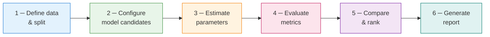

# Experiment Framework

The **Experiment Framework** provides a structured, reproducible pipeline for comparing
state-space models, filters, and estimation methods on the same dataset. Rather than writing
ad-hoc comparison loops, you declare what to compare and let `Experiment` handle the rest —
splitting data, fitting models, computing metrics, and producing a formatted report.

!!! abstract "When to use the Experiment Framework"
    - You have two or more competing model specifications and need an objective comparison
    - You want to compare filtering algorithms on the same model (e.g. Kalman vs Square-Root)
    - You need a reproducible record of model selection decisions (seed, split, metrics)
    - You want to run the same experiment from a YAML config file via the CLI

---

## 1. Concepts

### 1.1 What an experiment tracks

An `Experiment` object is a container for:

| Component | Description |
|-----------|-------------|
| **Data** | The time series $y_{1:T}$ and the temporal split into train/test |
| **Models** | Named candidate models (any kalmanbox model) |
| **Estimators** | How each model's parameters are estimated (MLE or Bayesian) |
| **Metrics** | Scalar evaluation functions applied to each fitted model |
| **Evaluation strategy** | In-sample, out-of-sample, or rolling cross-validation |
| **Results** | A `ResultsTable` with per-model metric values, rankings, and timing |

### 1.2 Evaluation strategies

=== "In-sample"

    All observations $y_{1:T}$ are used for both fitting and evaluation. Metrics are computed
    on the filtered/smoothed states over the full series.

    **Use for:** Log-likelihood, AIC, BIC, in-sample RMSE, residual diagnostics.

    $$
    \text{RMSE}_{\text{in}} = \sqrt{\frac{1}{T} \sum_{t=1}^{T} (y_t - \hat{y}_{t|t-1})^2}
    $$

=== "Out-of-sample"

    The series is split at index $T_{\text{train}}$. Models are fitted on
    $y_{1:T_\text{train}}$ and evaluated on $y_{T_\text{train}+1:T}$ via $h$-step-ahead
    forecasts.

    **Use for:** Forecasting RMSE, MAE, CRPS; honest model comparison.

    $$
    \text{RMSE}_{\text{oos}} = \sqrt{\frac{1}{h} \sum_{i=1}^{h} (y_{T_\text{train}+i} - \hat{y}_{T_\text{train}+i|T_\text{train}})^2}
    $$

=== "Rolling cross-validation"

    A sequence of expanding or sliding windows of length $T_w$ is used. In each fold $k$,
    the model is fitted on $y_{1:T_\text{train}^{(k)}}$ and evaluated on the next $h$ steps.

    $$
    \overline{\text{RMSE}}_{\text{CV}} = \frac{1}{K} \sum_{k=1}^{K} \text{RMSE}^{(k)}
    $$

    **Use for:** Robust out-of-sample evaluation; detecting non-stationarity.

### 1.3 Built-in metrics

| Metric | Key | Description |
|--------|-----|-------------|
| Log-likelihood | `log_likelihood` | $\ell(\hat\theta) = \sum_t \log p(y_t \mid y_{1:t-1})$ |
| AIC | `aic` | $-2\ell + 2k$ |
| BIC | `bic` | $-2\ell + k \log T$ |
| In-sample RMSE | `rmse_in` | Root mean squared one-step-ahead forecast error |
| In-sample MAE | `mae_in` | Mean absolute one-step-ahead forecast error |
| Out-of-sample RMSE | `rmse_oos` | RMSE on held-out test set |
| Out-of-sample MAE | `mae_oos` | MAE on held-out test set |
| CRPS | `crps` | Continuous ranked probability score (probabilistic accuracy) |
| Ljung-Box p-value | `ljung_box` | $H_0$: residuals are white noise (p > 0.05 desired) |
| Normality p-value | `normality` | Jarque-Bera test on standardised residuals |
| Runtime | `runtime_s` | Wall-clock time in seconds for fit + filter pass |

Custom metrics are supported via any `Callable[[FilterResult], float]`.

---

## 2. Experiment pipeline

The experiment runs in six ordered stages:



### Stage 1 — Define data and split

```python
from kalmanbox.experiment import Experiment
from kalmanbox.datasets import load_nile

y = load_nile().values  # shape (100,)

exp = Experiment(
    name="nile_model_comparison",
    y=y,
    train_size=0.8,        # 80 obs train, 20 obs test
    eval_strategy="out_of_sample",
    horizon=10,            # forecast 10 steps ahead
    random_state=42,
)
```

### Stage 2 — Configure model candidates

```python
from kalmanbox.structural import LocalLevel, BasicStructuralModel, UCM

exp.add_model(
    name="local_level",
    model=LocalLevel(),
    estimator="mle",
)

exp.add_model(
    name="bsm",
    model=BasicStructuralModel(period=12),
    estimator="mle",
)

exp.add_model(
    name="ucm_cycle",
    model=UCM(components=["level", "slope", "cycle"], cycle_period=20.0),
    estimator="mle",
)
```

### Stage 3 — Estimate parameters

Parameters are estimated automatically when `run()` is called. You can inspect parameter
estimates after the run:

```python
results = exp.run()

# Parameter estimates for each model
for name, model_result in results.model_results.items():
    print(f"\n--- {name} ---")
    print(model_result.params)
```

### Stage 4 — Evaluate metrics

Metrics are computed per model on the evaluation split:

```python
# Default metrics are always computed; add custom ones before run()
import numpy as np

def smape(result) -> float:
    y_obs = result.y_test
    y_hat = result.forecast_mean
    return float(np.mean(2 * np.abs(y_obs - y_hat) / (np.abs(y_obs) + np.abs(y_hat))))

exp.add_metric("smape", smape)
```

### Stage 5 — Compare and rank

After `run()`, the `ResultsTable` provides rankings:

```python
# Tabular comparison — all metrics
print(results.table())

# Rank models by a specific metric (lower is better for RMSE/AIC/BIC)
print(results.rank(by="aic"))

# Best model overall
best = results.best(by="rmse_oos")
print(f"Best model: {best}")
```

### Stage 6 — Generate report

```python
# HTML report (auto-opens in browser by default)
results.report(output="nile_comparison_report.html", open_browser=True)

# Markdown report (suitable for docs or PR comments)
results.report(output="nile_comparison_report.md", format="markdown")

# JSON export (for downstream processing)
results.export("nile_comparison_results.json")
```

---

## 3. Experiment API reference

### 3.1 `Experiment` constructor

```python
class Experiment:
    def __init__(
        self,
        name: str,
        y: np.ndarray,
        train_size: float | int = 0.8,
        eval_strategy: str = "out_of_sample",  # "in_sample" | "out_of_sample" | "rolling_cv"
        horizon: int = 1,
        cv_folds: int = 5,                     # only for rolling_cv
        cv_step: int = 1,                      # rolling window step size
        metrics: list[str] | None = None,      # subset of built-in metrics; None = all
        random_state: int | None = None,
        n_jobs: int = 1,                       # parallel model fitting (-1 = all cores)
        verbose: bool = False,
    ) -> None: ...
```

**Parameters:**

| Parameter | Type | Default | Description |
|-----------|------|---------|-------------|
| `name` | `str` | — | Identifier used in reports and saved results |
| `y` | `np.ndarray` | — | 1-D or 2-D time series array, shape `(T,)` or `(T, p)` |
| `train_size` | `float \| int` | `0.8` | Float: fraction of `T`; int: absolute number of training obs |
| `eval_strategy` | `str` | `"out_of_sample"` | Evaluation mode |
| `horizon` | `int` | `1` | Forecast horizon for OOS evaluation |
| `cv_folds` | `int` | `5` | Number of folds for rolling CV |
| `cv_step` | `int` | `1` | Steps between successive CV windows |
| `metrics` | `list[str] \| None` | `None` | Metrics to compute; `None` computes all built-in metrics |
| `random_state` | `int \| None` | `None` | Seed for reproducibility (Bayesian estimators, CV shuffling) |
| `n_jobs` | `int` | `1` | Parallelism across models; `-1` uses all cores |
| `verbose` | `bool` | `False` | Print per-model progress during `run()` |

### 3.2 `add_model()`

```python
def add_model(
    self,
    name: str,
    model: BaseStateSpaceModel,
    estimator: str | dict = "mle",
    filter_cls: type | None = None,
    fit_kwargs: dict | None = None,
) -> "Experiment": ...
```

**Parameters:**

| Parameter | Type | Default | Description |
|-----------|------|---------|-------------|
| `name` | `str` | — | Unique label for this model in comparisons |
| `model` | `BaseStateSpaceModel` | — | Any kalmanbox model instance |
| `estimator` | `str \| dict` | `"mle"` | `"mle"`, `"bayesian"`, or a dict with keys `method` and sampler kwargs |
| `filter_cls` | `type \| None` | `None` | Override the filter class (e.g. `SquareRootFilter`) |
| `fit_kwargs` | `dict \| None` | `None` | Extra kwargs forwarded to `model.fit()` |

The `filter_cls` parameter is the key to **filter comparison**: the same model can be run
with different filters by adding it multiple times with different `filter_cls` values.

Returns `self` for chaining:

```python
(exp
    .add_model("ll_kf",   LocalLevel(), filter_cls=KalmanFilter)
    .add_model("ll_sqf",  LocalLevel(), filter_cls=SquareRootFilter)
    .add_model("ll_info", LocalLevel(), filter_cls=InformationFilter))
```

### 3.3 `add_metric()`

```python
def add_metric(
    self,
    name: str,
    fn: Callable[[ModelResult], float],
) -> "Experiment": ...
```

The callable receives a `ModelResult` object with attributes:

- `y_train` — training observations
- `y_test` — held-out observations (or `None` for in-sample strategy)
- `filter_result` — the `FilterResult` from the filter pass
- `forecast_mean` — point forecast over `horizon` steps
- `forecast_cov` — forecast covariance
- `params` — fitted parameter dict
- `fit_time_s` — fitting time

### 3.4 `run()`

```python
def run(self) -> ExperimentResults: ...
```

Fits all registered models on the training split, applies estimators, computes all metrics,
and returns an `ExperimentResults` object. Models are run in parallel when `n_jobs != 1`.

### 3.5 `ExperimentResults`

```python
class ExperimentResults:
    model_results: dict[str, ModelResult]

    def table(
        self,
        metrics: list[str] | None = None,
        sort_by: str | None = None,
        ascending: bool = True,
    ) -> pd.DataFrame: ...

    def rank(
        self,
        by: str,
        ascending: bool = True,
    ) -> pd.DataFrame: ...

    def best(
        self,
        by: str,
        ascending: bool = True,
    ) -> str: ...

    def report(
        self,
        output: str | Path,
        format: str = "html",    # "html" | "markdown" | "pdf"
        open_browser: bool = False,
    ) -> Path: ...

    def export(
        self,
        path: str | Path,
        format: str = "json",    # "json" | "csv" | "pickle"
    ) -> Path: ...

    def plot_metric(
        self,
        metric: str,
        kind: str = "bar",       # "bar" | "heatmap"
        figsize: tuple | None = None,
    ) -> Figure: ...

    def plot_forecasts(
        self,
        models: list[str] | None = None,
        ci: float = 0.95,
    ) -> Figure: ...
```

---

## 4. YAML configuration

Every experiment can be defined in a YAML file, which serves as a self-contained,
version-controllable specification. The CLI reads these files directly.

```yaml
# nile_comparison.yaml
experiment:
  name: nile_model_comparison
  random_state: 42
  eval_strategy: out_of_sample
  train_size: 0.80
  horizon: 10
  n_jobs: -1
  verbose: true

data:
  dataset: nile           # built-in dataset; or path: /data/nile.csv
  # path: /path/to/data.csv
  # column: value         # column name if CSV has multiple columns

models:
  - name: local_level
    class: kalmanbox.structural.LocalLevel
    estimator: mle

  - name: bsm
    class: kalmanbox.structural.BasicStructuralModel
    params:
      period: 12
    estimator: mle

  - name: ucm_cycle
    class: kalmanbox.structural.UCM
    params:
      components: [level, slope, cycle]
      cycle_period: 20.0
    estimator: mle

  - name: local_level_bayesian
    class: kalmanbox.structural.LocalLevel
    estimator:
      method: bayesian
      n_iter: 4000
      burn_in: 1000
      n_chains: 4

metrics:
  - log_likelihood
  - aic
  - bic
  - rmse_in
  - rmse_oos
  - mae_oos
  - ljung_box
  - runtime_s

report:
  output: reports/nile_comparison.html
  format: html
  open_browser: false

export:
  path: results/nile_comparison.json
  format: json
```

Load and run from Python:

```python
from kalmanbox.experiment import Experiment

exp = Experiment.from_yaml("nile_comparison.yaml")
results = exp.run()
```

Or from the CLI:

```bash
kalmanbox experiment run nile_comparison.yaml
```

---

## 5. Example: comparing models on the Nile dataset

This example reproduces the classic Harvey (1989) analysis — comparing three structural
models for the annual Nile flow series.

```python
import numpy as np
from kalmanbox.experiment import Experiment
from kalmanbox.structural import LocalLevel, LocalLinearTrend, BasicStructuralModel
from kalmanbox.datasets import load_nile

y = load_nile().values   # 100 annual observations, 1871–1970

exp = Experiment(
    name="nile_structural_models",
    y=y,
    train_size=80,
    eval_strategy="out_of_sample",
    horizon=10,
    random_state=0,
    verbose=True,
)

exp.add_model("local_level",        LocalLevel(),              estimator="mle")
exp.add_model("local_linear_trend", LocalLinearTrend(),        estimator="mle")
exp.add_model("bsm",                BasicStructuralModel(period=4), estimator="mle")

results = exp.run()

print(results.table(sort_by="bic"))
```

Expected output (approximate):

```
                  log_likelihood     aic      bic  rmse_in  rmse_oos  mae_oos  ljung_box  runtime_s
local_level             -797.80  1601.6   1607.3    74.91     93.14    79.20       0.72       0.08
local_linear_trend      -796.92  1601.8   1610.4    73.46     94.81    81.05       0.68       0.11
bsm                     -795.34  1602.7   1616.0    71.23    101.22    86.40       0.63       0.14
```

!!! info "Interpreting the results"
    The **Local Level** model achieves the best BIC because it has only 2 parameters
    ($\sigma_\varepsilon^2$, $\sigma_\eta^2$) while providing nearly as good in-sample fit as
    the richer BSM. The BSM's lower log-likelihood is offset by its higher parameter count.
    For 10-step-ahead OOS forecasting, the Local Level is also more accurate — additional
    structure is not supported by this short series.

```python
# Visual comparison
results.plot_forecasts(ci=0.90)
results.plot_metric("rmse_oos")

# Full HTML report
results.report("nile_comparison.html", open_browser=True)
```

---

## 6. Example: comparing filters for numerical stability

The same model can be run with different filter backends to compare numerical behaviour on
long or ill-conditioned series. This is the primary use case for `filter_cls`.

```python
import numpy as np
from kalmanbox.experiment import Experiment
from kalmanbox.structural import DynamicFactorModel
from kalmanbox.filters import KalmanFilter, SquareRootFilter, InformationFilter
from kalmanbox.datasets import load_us_macro

y = load_us_macro().values   # 240 obs × 7 variables

exp = Experiment(
    name="dfm_filter_stability",
    y=y,
    train_size=200,
    eval_strategy="out_of_sample",
    horizon=12,
    random_state=42,
    n_jobs=3,
)

dfm = DynamicFactorModel(n_factors=2, factor_order=2)

exp.add_model("dfm_kalman",      dfm, filter_cls=KalmanFilter,      estimator="mle")
exp.add_model("dfm_square_root", dfm, filter_cls=SquareRootFilter,  estimator="mle")
exp.add_model("dfm_information", dfm, filter_cls=InformationFilter, estimator="mle")

results = exp.run()
print(results.table(sort_by="rmse_oos"))
```

To compare **condition numbers** of the filtered covariance matrices — the key diagnostic
for numerical stability — add a custom metric:

```python
import numpy as np

def max_cond_number(model_result) -> float:
    P = model_result.filter_result.filtered_covariances   # shape (T, k, k)
    return float(np.max([np.linalg.cond(P[t]) for t in range(P.shape[0])]))

exp.add_metric("max_cond_P", max_cond_number)
```

!!! tip "When numerical stability matters"
    For univariate structural models on short series, all three filters produce identical
    results to machine precision. Numerical differences emerge for:

    - **Dynamic Factor Models** with $k \geq 10$ state variables
    - **Long time series** ($T \geq 10^4$) where rounding errors accumulate
    - **Small signal-to-noise ratios** ($q = \sigma_\eta^2 / \sigma_\varepsilon^2 \ll 1$)
      which push $P_t$ toward near-singularity

---

## 7. Example: benchmarking alternative filters

The following example benchmarks all six kalmanbox filters on the same nonlinear model
to compare accuracy and runtime.

```python
import numpy as np
from kalmanbox import KalmanFilter
from kalmanbox.filters import (
    EKF, UKF, SquareRootFilter, InformationFilter, EnKF, EnKFModel,
)
from kalmanbox.structural import LocalLevel
from kalmanbox.experiment import Experiment

# Simulated nonlinear data (growth model: level with log-link observation)
rng  = np.random.default_rng(0)
T    = 300
mu   = np.cumsum(rng.normal(0, 0.05, T)) + 5.0
y    = np.exp(mu) + rng.normal(0, 0.5, T)

# Base linear model — filters 1–4 are exact for this specification
ll_model = LocalLevel()

exp = Experiment(
    name="filter_benchmark",
    y=y,
    train_size=0.75,
    eval_strategy="out_of_sample",
    horizon=20,
    metrics=["rmse_oos", "mae_oos", "log_likelihood", "runtime_s"],
    random_state=0,
    n_jobs=-1,
)

exp.add_model("kalman",      ll_model, filter_cls=KalmanFilter,      estimator="mle")
exp.add_model("square_root", ll_model, filter_cls=SquareRootFilter,  estimator="mle")
exp.add_model("information", ll_model, filter_cls=InformationFilter, estimator="mle")
exp.add_model("ekf",         ll_model, filter_cls=EKF,               estimator="mle")
exp.add_model("ukf",         ll_model, filter_cls=UKF,               estimator="mle")

results = exp.run()

print(results.table(sort_by="rmse_oos"))
results.plot_metric("runtime_s", kind="bar")
```

---

## 8. Reproducibility

Reproducibility is a first-class concern in the Experiment Framework. Every experiment
captures enough state to reproduce results exactly.

### 8.1 Setting seeds

The `random_state` passed to `Experiment` is used as the root seed for:

- Bayesian sampler initialization (forwarded to `GibbsSampler` / `FFBS`)
- Rolling CV fold randomization (if `cv_shuffle=True`)
- EnKF initial ensemble generation

For fully deterministic results, also set NumPy's global seed before calling `run()`:

```python
import numpy as np
np.random.seed(42)   # ensures third-party libraries also get a fixed seed

exp = Experiment(..., random_state=42)
results = exp.run()
```

### 8.2 Logging

kalmanbox writes a structured log to `~/.kalmanbox/logs/` by default. Each experiment run
appends a JSON record:

```json
{
  "experiment": "nile_model_comparison",
  "timestamp": "2026-05-16T14:32:11Z",
  "random_state": 42,
  "train_size": 80,
  "eval_strategy": "out_of_sample",
  "horizon": 10,
  "models": ["local_level", "bsm", "ucm_cycle"],
  "best_by_bic": "local_level",
  "runtime_total_s": 0.41
}
```

Configure log location:

```python
from kalmanbox.experiment import Experiment

exp = Experiment(
    name="my_experiment",
    y=y,
    log_dir="/path/to/logs",   # override default
    log_level="INFO",          # "DEBUG" | "INFO" | "WARNING" | "ERROR"
)
```

### 8.3 Results versioning

Export results to a timestamped file for an audit trail:

```python
import datetime

tag = datetime.datetime.now().strftime("%Y%m%d_%H%M%S")
results.export(f"results/nile_comparison_{tag}.json")
```

Or use the `version_tag` parameter:

```python
results = exp.run(version_tag="v1.2.0")
# Saved automatically to: results/<name>/<name>_v1.2.0.json
```

### 8.4 Reproducibility report

The HTML report includes a **Reproducibility** section with:

- kalmanbox version, Python version, platform
- NumPy/SciPy versions
- Exact random seed and data hash (SHA-256 of `y`)
- Full parameter estimates and initialisation values
- YAML config (if experiment was loaded from file)

```python
results.report(
    "my_report.html",
    include_reproducibility=True,   # default True
    include_params=True,
    include_data_hash=True,
)
```

---

## 9. CLI integration

The `kalmanbox experiment` command group provides a full CLI interface.

### 9.1 Running an experiment

```bash
# Run from a YAML config
kalmanbox experiment run nile_comparison.yaml

# Override output path
kalmanbox experiment run nile_comparison.yaml --output reports/my_report.html

# Dry run: validate config without fitting models
kalmanbox experiment run nile_comparison.yaml --dry-run

# Suppress progress output
kalmanbox experiment run nile_comparison.yaml --quiet
```

### 9.2 Inspecting results

```bash
# Print results table to terminal
kalmanbox experiment show results/nile_comparison.json

# Show only specific metrics
kalmanbox experiment show results/nile_comparison.json --metrics aic,bic,rmse_oos

# Show ranked results
kalmanbox experiment show results/nile_comparison.json --sort-by bic
```

### 9.3 Generating reports from saved results

```bash
# Regenerate HTML report from saved JSON
kalmanbox experiment report results/nile_comparison.json --output reports/report.html

# Export to Markdown (for docs or PR descriptions)
kalmanbox experiment report results/nile_comparison.json --format markdown
```

### 9.4 Managing experiment configs

```bash
# Validate a YAML config without running
kalmanbox experiment validate nile_comparison.yaml

# List available built-in datasets
kalmanbox experiment datasets

# List available model classes
kalmanbox experiment models
```

### 9.5 Full CLI example

```bash
# 1. Validate the config
kalmanbox experiment validate nile_comparison.yaml

# 2. Run the experiment
kalmanbox experiment run nile_comparison.yaml \
    --output reports/nile_comparison.html \
    --export results/nile_$(date +%Y%m%d).json

# 3. Show results summary
kalmanbox experiment show results/nile_$(date +%Y%m%d).json --sort-by bic
```

---

## 10. Advanced patterns

### 10.1 Grid search over hyperparameters

Use `add_model()` in a loop to perform a grid search:

```python
from kalmanbox.structural import UCM
from kalmanbox.experiment import Experiment

exp = Experiment(name="ucm_cycle_grid", y=y, train_size=0.8,
                 eval_strategy="out_of_sample", horizon=12, random_state=0)

for period in [8, 12, 16, 20, 24]:
    exp.add_model(
        name=f"ucm_cycle_{period}",
        model=UCM(components=["level", "cycle"], cycle_period=float(period)),
        estimator="mle",
    )

results = exp.run()
print(results.rank(by="bic"))
```

### 10.2 MLE vs Bayesian comparison

The same model can be registered with both estimators:

```python
from kalmanbox.structural import LocalLevel
from kalmanbox.bayesian import InverseGamma

model = LocalLevel()

exp.add_model("ll_mle", model, estimator="mle")

exp.add_model(
    "ll_bayes",
    model,
    estimator={
        "method": "bayesian",
        "priors": {
            "sigma2_obs":   InverseGamma(shape=2.5, scale=0.1),
            "sigma2_level": InverseGamma(shape=2.5, scale=0.05),
        },
        "n_iter": 4000,
        "burn_in": 1000,
        "n_chains": 4,
        "random_state": 42,
    },
)
```

### 10.3 Using custom models

Any class implementing `BaseStateSpaceModel` can be added:

```python
from kalmanbox.models import BaseStateSpaceModel
import numpy as np

class MyCustomModel(BaseStateSpaceModel):
    def __init__(self, rho: float = 0.9):
        self.rho = rho

    def build_matrices(self, params: dict) -> dict:
        rho = params.get("rho", self.rho)
        return {
            "T": np.array([[rho]]),
            "Z": np.array([[1.0]]),
            "R": np.array([[1.0]]),
            "Q": np.array([[params["sigma2_eta"]]]),
            "H": np.array([[params["sigma2_eps"]]]),
        }

exp.add_model("ar1_ssm", MyCustomModel(rho=0.85), estimator="mle")
```

### 10.4 Post-run analysis

`ExperimentResults` stores the full `FilterResult` for each model, enabling deep analysis:

```python
results = exp.run()

# Extract filtered states for the best model
best_name = results.best(by="bic")
fr = results.model_results[best_name].filter_result

print(f"Log-likelihood: {fr.log_likelihood:.2f}")
print(f"Filtered states (last 5):\n{fr.filtered_states[-5:]}")

# Run smoother on the best model
from kalmanbox import RTSSmoother
smoother = RTSSmoother(model=results.model_results[best_name].fitted_model)
smooth_result = smoother.smooth(y)
```

---

## 11. Common pitfalls

| Pitfall | Symptom | Remedy |
|---------|---------|--------|
| Different train splits across models | Results not comparable | Always use a single `Experiment` instance |
| Bayesian estimator without `random_state` | Non-reproducible rankings | Set `random_state` on `Experiment` |
| Comparing AIC across different datasets | Meaningless numbers | Only compare metrics on the same evaluation split |
| `n_jobs=-1` with Bayesian models | Memory overload | Each chain uses RAM; limit `n_jobs` |
| Adding models after `run()` | `RuntimeError` | Create a new `Experiment` or use `reset()` |
| Missing test data for OOS metrics | `NaN` in results table | Ensure `train_size < 1.0` for OOS strategy |

---

## See also

| Topic | Page |
|-------|------|
| Posterior diagnostics for Bayesian models | [Posterior Diagnostics](bayesian/posterior-diagnostics.md) |
| Filter selection guide | [Filter Comparison](filters/comparison.md) |
| Information criteria theory | [Information Criteria](../diagnostics/information-criteria.md) |
| Residual diagnostic tests | [Residual Analysis](../diagnostics/residuals.md) |
| Full benchmark suite | [Benchmarks](../benchmarks/index.md) |
| CLI command reference | [API: CLI](../api/cli.md) |
| Experiment class API | [API: Experiment](../api/experiment.md) |
| Choosing the right model | [Choosing a Model](../getting-started/choosing-model.md) |
