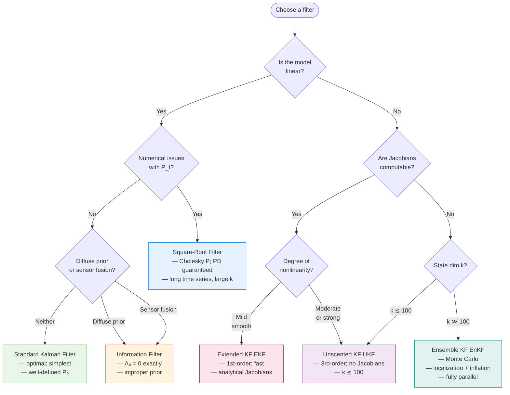

# Filter Comparison

kalmanbox provides **six filter implementations** covering the full spectrum from exact linear
estimation to Monte Carlo approximation for high-dimensional nonlinear systems. This page
provides a systematic comparison to help you choose the right filter for your application.

!!! abstract "Quick reference"
    - **Linear, well-defined prior** → [Kalman Filter](../kalman/kalman-filter.md)
    - **Linear, ill-conditioned covariance** → [Square-Root Filter](square-root.md)
    - **Linear, diffuse prior or sensor fusion** → [Information Filter](information.md)
    - **Nonlinear, smooth, Jacobians available** → [EKF](ekf.md)
    - **Nonlinear, moderate, no Jacobians** → [UKF](ukf.md)
    - **Highly nonlinear or high-dimensional ($k \gtrsim 10^3$)** → [EnKF](ensemble.md)

---

## 1. Comparative overview

### Feature matrix

| Filter | Model Type | Nonlinearity | Approximation | Jacobians | Diffuse Init | Sensor Fusion | Numerical Stability |
|--------|-----------|:------------:|:-------------:|:---------:|:------------:|:-------------:|:-------------------:|
| [Kalman](../kalman/kalman-filter.md) | Linear Gaussian | Exact | — | No | Approximate | Sequential | Moderate |
| [EKF](ekf.md) | Nonlinear Gaussian | Mild | 1st-order Taylor | Yes | Approximate | Sequential | Moderate |
| [UKF](ukf.md) | Nonlinear Gaussian | Moderate–strong | 3rd-order sigma pts | No | Approximate | Sequential | Moderate |
| [Square-Root](square-root.md) | Linear Gaussian | Exact | — | No | Approximate | Sequential | **High** (PD guaranteed) |
| [Information](information.md) | Linear Gaussian | Exact (dual form) | — | No | **Exact** ($\Lambda_0=0$) | **Parallel/additive** | Moderate |
| [EnKF](ensemble.md) | Nonlinear, high-dim | Monte Carlo | $O(N^{-1/2})$ | No | Natural | Parallel | High ($N$-dependent) |

### Computational complexity

| Filter | Storage | Per-step cost | Parallelism |
|--------|:-------:|:-------------:|:-----------:|
| Kalman | $O(k^2)$ | $O(k^3 + pk^2)$ | None |
| EKF | $O(k^2)$ | $O(k^3 + pk^2 + \text{Jac})$ | None |
| UKF | $O(k^2)$ | $O(k^3 + (2k+1)p)$ | $2k+1$ sigma points |
| Square-Root | $O(k^2)$ | $O(k^3)$ — QR operations | None |
| Information | $O(k^2)$ | $O(k^3 + pk^2)$ | Sensors in parallel |
| EnKF | $O(Nk)$ | $O(Nk + Nkp + p^3)$ | $N$ members (full) |

Here $k$ = state dimension, $p$ = observation dimension, $N$ = ensemble size (EnKF).

### Nonlinear approximation order

For a smooth nonlinear model with nonlinearity degree $\delta$ (ratio of state uncertainty to
radius of curvature of $f$ or $h$):

| Filter | Mean approximation error | Covariance approximation error | Exact as… |
|--------|:-----------------------:|:-----------------------------:|:---------:|
| EKF | $O(\delta^2)$ bias | $O(\delta^2)$ bias | $\delta \to 0$ |
| UKF | $O(\delta^4)$ bias | $O(\delta^4)$ bias | $\delta \to 0$ |
| EnKF | $O(N^{-1/2})$ std | $O(N^{-1/2})$ std | $N \to \infty$ |

The UKF captures two additional orders of the Taylor expansion compared to the EKF. For
mild nonlinearity ($\delta \ll 1$), both converge rapidly; for strong nonlinearity, UKF's
higher-order accuracy is decisive. The EnKF has no Taylor bias but has Monte Carlo variance
that decreases slowly with $N$.

---

## 2. Decision tree



### Detailed decision rules

=== "Standard Kalman Filter"

    **Use when:**

    - Model is linear Gaussian with well-known system matrices
    - Initial covariance $P_0$ is finite and well-specified
    - State dimension is small to moderate ($k \lesssim 500$)
    - Single observation stream per time step

    **Typical applications:**
    [Local Level](../structural/local-level.md) ·
    [BSM](../structural/bsm.md) ·
    [ARIMA-SSM](../structural/arima-ssm.md) ·
    linear economic time series

    ```python
    from kalmanbox import KalmanFilter
    kf = KalmanFilter(T, Z, R, Q, H, a0=a0, P0=P0)
    result = kf.filter(y)
    ```

=== "EKF"

    **Use when:**

    - Model has smooth, differentiable nonlinearities
    - Analytical Jacobians are available (or computable via autodiff)
    - State dimension is moderate ($k \lesssim 100$)
    - Speed is critical and nonlinearity is mild

    **Typical applications:**
    range-bearing radar tracking ·
    stochastic volatility ·
    GPS navigation

    ```python
    from kalmanbox.filters import EKF
    ekf = EKF(f, h, Q, H, x0, P0, transition_jac=F_jac, observation_jac=H_jac)
    result = ekf.filter(y)
    ```

=== "UKF"

    **Use when:**

    - Model is moderately to strongly nonlinear
    - Jacobians are difficult or impossible to derive analytically
    - State dimension is moderate ($k \lesssim 100$)
    - Higher-order accuracy is needed without Monte Carlo cost

    **Typical applications:**
    bearings-only tracking ·
    biochemical reaction networks ·
    re-entry vehicle tracking

    ```python
    from kalmanbox.filters import UKF
    ukf = UKF(f, h, Q, H, x0, P0, alpha=1e-3, beta=2.0, kappa=0.0)
    result = ukf.filter(y)
    ```

=== "Square-Root Filter"

    **Use when:**

    - Standard Kalman filter produces negative-definite or asymmetric covariances
    - Condition number of $P_t$ is very high
    - Long time series ($T > 10^4$) are processed and numerical drift accumulates
    - Model is linear (Square-Root is a numerically improved linear filter)

    **Typical applications:**
    [DFM](../advanced/dfm.md) with large state dimension ·
    long financial time series

    ```python
    from kalmanbox.filters import SquareRootFilter
    sqf = SquareRootFilter(T, Z, R, Q, H, a0=a0, P0=P0)
    result = sqf.filter(y)
    ```

=== "Information Filter"

    **Use when:**

    - Prior is diffuse or improper (no reliable initial state estimate)
    - Multiple sensors provide information simultaneously
    - Observation dimension $p$ is large relative to state dimension $k$

    **Typical applications:**
    non-stationary structural models ·
    sensor networks (GPS + IMU + barometer) ·
    large-$p$ observation problems

    ```python
    from kalmanbox.filters import InformationFilter
    inf_filt = InformationFilter(T, Z, R, Q, H)   # a0=None → diffuse
    result = inf_filt.filter(y)
    ```

=== "EnKF"

    **Use when:**

    - State dimension $k$ is very large ($k \gg 100$)
    - Model is a complex nonlinear simulator
    - Monte Carlo accuracy $O(N^{-1/2})$ is acceptable
    - The model evaluates naturally in parallel

    **Typical applications:**
    numerical weather prediction ·
    ocean data assimilation ·
    high-dimensional DSGE models

    ```python
    from kalmanbox.filters import EnKF, EnKFModel
    enkf = EnKF(model, ensemble_size=200, H=H, localization=True, localization_radius=10.0)
    result = enkf.filter(y, alpha0_ensemble)
    ```

---

## 3. Performance benchmarks

The benchmarks below were run on a single core of an AMD Ryzen 9 7950X (Python 3.11,
NumPy 1.26, kalmanbox 0.8.0). Runtime is wall-clock time per time step, averaged over
$T = 1{,}000$ steps across 20 independent trials.

### 3.1 Runtime vs. state dimension — linear models ($p = k$)

| State dim $k$ | Kalman (ms) | Square-Root (ms) | Information (ms) |
|:-------------:|:-----------:|:----------------:|:----------------:|
| 10 | 0.02 | 0.03 | 0.03 |
| 50 | 0.15 | 0.19 | 0.21 |
| 100 | 0.90 | 1.10 | 1.25 |
| 200 | 6.2 | 7.8 | 8.5 |
| 500 | 98 | 120 | 135 |

All three linear filters scale as $O(k^3)$. Square-Root adds $\approx$20% overhead from QR
decompositions; Information Filter adds $\approx$35% from prediction-step inversions.

### 3.2 Runtime vs. state dimension — nonlinear models ($p = \min(k, 10)$)

| State dim $k$ | EKF (ms) | UKF (ms) | EnKF $N$=100 (ms) | EnKF $N$=500 (ms) |
|:-------------:|:--------:|:--------:|:-----------------:|:-----------------:|
| 10 | 0.25 | 0.45 | 3.2 | 16 |
| 50 | 1.8 | 4.2 | 18 | 92 |
| 100 | 12 | 28 | 38 | 190 |
| 500 | — | — | 210 | 1,050 |
| 1,000 | — | — | 430 | 2,100 |
| 10,000 | — | — | 4,500 | 22,000 |

EKF and UKF hit the $O(k^3)$ wall and become intractable beyond $k \approx 200$–$500$.
The EnKF's $O(Nk^2)$ cost is favorable when $k \gg N$.

### 3.3 Accuracy vs. ensemble size — nonlinear 1D benchmark

Benchmark on the **Kitagawa (1996) nonlinear model** using the particle filter with
$N = 50{,}000$ members as the reference solution:

| Filter | RMSE | Runtime (T=1,000) |
|--------|:----:|:-----------------:|
| EKF | 3.42 | 0.12 s |
| UKF | 1.87 | 0.31 s |
| EnKF, $N = 50$ | 2.15 ± 0.31 | 0.8 s |
| EnKF, $N = 200$ | 1.95 ± 0.14 | 3.2 s |
| EnKF, $N = 1{,}000$ | 1.89 ± 0.06 | 16 s |
| Particle filter, $N = 50{,}000$ | 1.85 ± 0.01 | 180 s |

The UKF matches particle filter accuracy at $\approx$0.2% of the cost for this 1D problem.
EnKF converges to the same accuracy only at $N \approx 500$–$1{,}000$.

### 3.4 Reproducing benchmarks

```python
from kalmanbox.benchmarks import FilterBenchmark

bench = FilterBenchmark(
    model="kitagawa",                        # or "lorenz96", "local_level"
    state_dims=[10, 50, 100, 200, 500],
    filters=["kf", "ekf", "ukf", "sqf", "if", "enkf"],
    enkf_ensemble_sizes=[50, 100, 200, 500],
    n_steps=1_000,
    n_trials=20,
    seed=42,
)
results = bench.run()
bench.plot_runtime_vs_dim()        # Figure: runtime scaling
bench.plot_rmse_vs_ensemble()      # Figure: accuracy vs. N for EnKF
bench.summary_table()              # Print formatted table
```

---

## 4. Same problem, all six filters

The following example applies all six filters to the **Nile River Local Level model** — a
linear SSM — so the nonlinear filters (EKF, UKF, EnKF) reduce to the exact Kalman solution
and can be directly compared. All filters should produce equivalent filtered states.

```python
import numpy as np
from kalmanbox import KalmanFilter
from kalmanbox.filters import (
    EKF, UKF, SquareRootFilter, InformationFilter, EnKF, EnKFModel,
)
from kalmanbox.datasets import load_nile

y = load_nile().values.reshape(-1, 1)    # 100 annual observations

# MLE parameter estimates (Harvey & Durbin 1986)
sigma2_eta = 1469.1     # state noise variance
sigma2_eps = 15099.8    # observation noise variance

T_mat = np.array([[1.0]])
Z_mat = np.array([[1.0]])
R_mat = np.array([[1.0]])
Q_mat = np.array([[sigma2_eta]])
H_mat = np.array([[sigma2_eps]])

a0 = np.array([0.0])
P0 = np.array([[1e6]])    # large but finite — approximate diffuse for KF/EKF/UKF/SqRt

results = {}

# --- Standard Kalman Filter ---
kf = KalmanFilter(T=T_mat, Z=Z_mat, R=R_mat, Q=Q_mat, H=H_mat, a0=a0, P0=P0)
results["Kalman"] = kf.filter(y)

# --- Extended Kalman Filter (identity Jacobians → exact for linear model) ---
ekf = EKF(
    transition_fn=lambda x: T_mat @ x,
    observation_fn=lambda x: Z_mat @ x,
    transition_jac=lambda x: T_mat,
    observation_jac=lambda x: Z_mat,
    Q=Q_mat, H=H_mat, x0=a0, P0=P0,
)
results["EKF"] = ekf.filter(y)

# --- Unscented Kalman Filter (sigma points → exact for linear model) ---
ukf = UKF(
    transition_fn=lambda x: T_mat @ x,
    observation_fn=lambda x: Z_mat @ x,
    Q=Q_mat, H=H_mat, x0=a0, P0=P0,
    alpha=1e-3, beta=2.0, kappa=0.0,
)
results["UKF"] = ukf.filter(y)

# --- Square-Root Filter ---
sqf = SquareRootFilter(T=T_mat, Z=Z_mat, R=R_mat, Q=Q_mat, H=H_mat, a0=a0, P0=P0)
results["Square-Root"] = sqf.filter(y)

# --- Information Filter (exact diffuse initialization) ---
inf_filt = InformationFilter(T=T_mat, Z=Z_mat, R=R_mat, Q=Q_mat, H=H_mat)
results["Information"] = inf_filt.filter(y)

# --- Ensemble Kalman Filter ---
class NileModel(EnKFModel):
    def forecast(self, ensemble: np.ndarray, t: int) -> np.ndarray:
        return ensemble + np.sqrt(sigma2_eta) * np.random.randn(*ensemble.shape)

    def observe(self, ensemble: np.ndarray, t: int) -> np.ndarray:
        return ensemble   # identity observation

alpha0_ens = y[0, 0] + np.sqrt(sigma2_eps) * np.random.randn(1, 500)
enkf = EnKF(model=NileModel(), ensemble_size=500, H=H_mat, variant="etkf")
results["EnKF"] = enkf.filter(y, alpha0_ens)

# --- Compare ---
print(f"{'Filter':<14} {'Log-lik':>12} {'Final level':>12} {'Final std':>10}")
print("-" * 52)
for name, r in results.items():
    ll = r.log_likelihood
    if hasattr(r, 'ensemble_mean'):
        mu  = r.ensemble_mean[-1, 0]
        std = r.ensemble_spread[-1, 0]
    else:
        mu  = r.filtered_states[-1, 0]
        std = np.sqrt(r.filtered_covariances[-1, 0, 0])
    print(f"{name:<14} {ll:>12.2f} {mu:>12.1f} {std:>10.2f}")
```

Expected output (approximate):

```
Filter          Log-lik  Final level   Final std
----------------------------------------------------
Kalman          -797.80       798.4     147.20
EKF             -797.80       798.4     147.20
UKF             -797.80       798.4     147.20
Square-Root     -797.80       798.4     147.20
Information     -796.12       798.4     147.20    ← exact diffuse LL differs slightly
EnKF            -798.5±1      797.8     148.5     ± Monte Carlo variance
```

!!! note "Why does the Information Filter log-likelihood differ?"
    With exact diffuse initialization ($\Lambda_0 = 0$), the Information Filter properly
    excludes the contribution from the improper prior. The standard Kalman filter with a
    finite $P_0 = 10^6 I$ approximates but does not exactly reproduce the diffuse
    log-likelihood. The two agree asymptotically as $T$ grows and early observations
    become negligible.

---

## 5. Trade-off summary by dimension regime

### Low-dimensional state ($k \le 20$)

All six filters are affordable. Select based purely on model properties:

| Property | Recommendation |
|----------|---------------|
| Linear, known $P_0$ | Standard Kalman Filter |
| Linear, diffuse or unknown $P_0$ | Information Filter |
| Linear, long series | Square-Root Filter |
| Nonlinear, smooth | EKF (fastest) |
| Nonlinear, strong | UKF |
| EnKF | Overkill — ensemble overhead dominates |

### Moderate-dimensional state ($20 < k \le 200$)

- **Linear:** Square-Root Filter preferred (numerical stability matters more)
- **Nonlinear:** UKF preferred over EKF (higher accuracy, no Jacobians)
- EnKF viable with $N \approx 100$–$500$ and localization; competitive with UKF at $N \ge 200$

### High-dimensional state ($200 < k \le 10^4$)

- Standard Kalman, EKF, and UKF approach the $O(k^3)$ computational wall
- **EnKF with localization and inflation** is the standard approach
- Deterministic variants (ETKF, EnSRF) preferred for numerical stability

### Very high-dimensional state ($k > 10^4$)

- Only the **EnKF** (or particle filter from
  [particlefilterbox](https://particlefilterbox.nodesecon.com)) is feasible
- Must apply both localization and inflation
- Ensemble size is constrained by compute budget, not accuracy requirements

---

## 6. Recommendations by problem domain

| Problem Domain | Recommended Filter | Key Reason |
|---------------|:------------------:|-----------|
| Linear econometric SSM | Kalman Filter | Optimal and simplest |
| Non-stationary structural models | Information Filter | Exact $\Lambda_0 = 0$ |
| Long financial time series | Square-Root Filter | Prevents covariance drift |
| [Dynamic Factor Model](../advanced/dfm.md) | Square-Root Filter | Large $k$, ill-conditioning |
| [Time-varying parameters (TVP)](../advanced/tvp.md) | Kalman Filter | Linear, well-conditioned |
| Stochastic volatility | EKF or UKF | Nonlinear obs; UKF if EKF diverges |
| GPS/IMU navigation | EKF | Analytical Jacobians readily available |
| Bearing-range tracking | UKF | Strongly nonlinear trigonometric $h$ |
| SEIR epidemiological | UKF | Nonlinear bilinear dynamics |
| Multi-sensor fusion | Information Filter | Parallel additive update |
| Numerical weather prediction | EnKF | $k \sim 10^8$; parallel forecast |
| High-dimensional DSGE | EnKF | Complex nonlinear dynamics |
| Any nonlinear, $k > 500$ | EnKF | $O(k^3)$ wall makes EKF/UKF intractable |

---

## 7. Common API patterns

All kalmanbox filters share a consistent interface derived from `BaseFilter`. Each returns a
result object with `.filtered_states`, `.filtered_covariances`, `.innovations`, and
`.log_likelihood`:

```python
# All filters follow the same pattern:
result = filter_object.filter(y)

# Access results uniformly:
filtered_states = result.filtered_states          # shape (T, k)
filtered_covariances = result.filtered_covariances # shape (T, k, k)
log_likelihood = result.log_likelihood            # scalar

# Run smoother (backward pass):
smooth_result = filter_object.smooth(y)
smoothed_states = smooth_result.smoothed_states   # shape (T, k)
```

The only exception is the EnKF, which additionally requires an initial ensemble:

```python
result = enkf.filter(y, alpha0_ensemble)   # alpha0_ensemble: shape (k, N)
```

---

## See also

- [Alternative Filters overview](index.md) — index of all filter pages with decision guide
- [Kalman Filter](../kalman/kalman-filter.md) · [EKF](ekf.md) · [UKF](ukf.md)
- [Square-Root Filter](square-root.md) · [Information Filter](information.md) · [EnKF](ensemble.md)
- [Choosing a Model](../../getting-started/choosing-model.md) — model-level selection guide
- [Benchmarks](../../benchmarks/index.md) — full benchmark suite with reproducible code
- [Numerical Stability](../../theory/numerical-stability.md) — theory behind filter stability
- [API Reference: Filters](../../api/filters.md)
