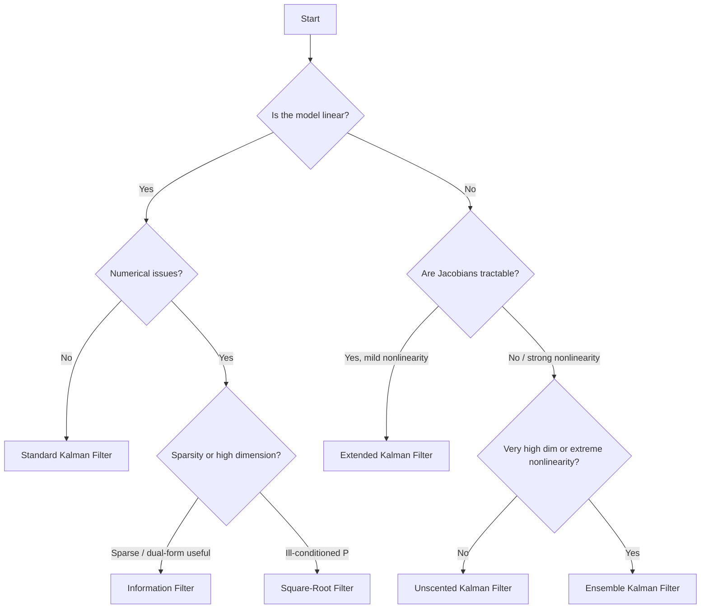

# Alternative Filters

The standard [Kalman filter](../kalman/kalman-filter.md) is the optimal linear estimator for
**linear Gaussian state-space models**. In practice, many real-world problems violate one or
both of those assumptions: dynamics may be governed by nonlinear functions, or the covariance
recursion may be numerically ill-conditioned over long time series. The alternative filters in
kalmanbox address these challenges while retaining the recursive, predict-update structure of
the classical Kalman filter.

!!! abstract "What you will find here"
    - A precise account of *why* the linear Kalman filter is insufficient for certain problems
    - A comparative overview of the five alternative filters available in kalmanbox
    - A decision guide for selecting the right filter for your application
    - Links to detailed pages for each filter

---

## Why alternative filters?

### Nonlinearity

The Kalman filter is derived under the assumption that both the **state transition** and
**observation** functions are linear:

$$
\alpha_{t+1} = T\,\alpha_t + R\,\eta_t, \qquad y_t = Z\,\alpha_t + \varepsilon_t
$$

Many physical and economic models are inherently nonlinear. Examples:

- **Bearings-only tracking** — a radar measures angle $\theta_t = \arctan(y_t / x_t)$, a
  nonlinear function of the Cartesian state $(x_t, y_t)$
- **Stochastic volatility** — log-variance follows a linear AR(1), but the observation is
  $y_t = \exp(h_t/2)\,\varepsilon_t$, nonlinear in the state $h_t$
- **SEIR epidemiological models** — infection dynamics are governed by products of compartment
  sizes, not linear combinations
- **Navigation with GPS** — range measurements are Euclidean distances, nonlinear in position

When the model is nonlinear, applying the standard Kalman filter directly will produce biased,
inconsistent estimates with unreliable covariance matrices.

### Numerical ill-conditioning

Even for linear models, the standard Kalman covariance recursion:

$$
P_{t|t-1} = T\,P_{t-1|t-1}\,T' + R\,Q\,R'
$$

operates on the full covariance matrix $P$. Under repeated multiplication and addition,
$P$ can lose positive-definiteness due to rounding errors — especially severe when:

- The state dimension is large
- The condition number of $P$ is high (very different eigenvalue scales)
- The filter runs over long time series

The **Square-Root filter** addresses this by factoring $P = S\,S'$ and propagating only
$S$ (the Cholesky factor), guaranteeing positive-definiteness by construction.

---

## Filter comparison

| Filter | Handles nonlinearity | Linearization | Jacobians required | Numerical stability | Cost |
|--------|:-------------------:|:------------:|:-----------------:|:-------------------:|------|
| [Kalman](../kalman/kalman-filter.md) | No — linear only | Exact | No | Moderate | $O(k^3)$ |
| [EKF](ekf.md) | Yes — mild nonlinearity | 1st-order Taylor | Yes | Moderate | $O(k^3)$ |
| [UKF](ukf.md) | Yes — moderate to strong | Sigma-point (3rd-order) | No | Moderate | $O(k^3)$ |
| [Square-Root](square-root.md) | No — linear only | Exact | No | High (PD guaranteed) | $O(k^3)$ |
| [Information](information.md) | No — linear only | Exact (dual form) | No | High for sparse | $O(k^3)$ |
| [Ensemble (EnKF)](enkf.md) | Yes — extreme nonlinearity | Monte Carlo | No | High | $O(N k^2)$ |

!!! info "Notation"
    $k$ = state dimension, $N$ = ensemble size (EnKF). "Moderate" stability means the filter
    can accumulate asymmetry in $P$ without special precautions. "High" means the formulation
    guarantees positive-definiteness or positive-semidefiniteness.

### Accuracy comparison for nonlinear filters

For mild nonlinearity, EKF and UKF often yield similar accuracy, but UKF captures higher-order
moments more faithfully:

| Filter | Approximation order | Mean error | Variance error |
|--------|---------------------|-----------|---------------|
| EKF | 1st order (Taylor) | $O(\delta^2)$ bias | $O(\delta^2)$ bias |
| UKF | 3rd order (sigma pts) | $O(\delta^4)$ bias | $O(\delta^4)$ bias |
| EnKF | Monte Carlo ($N \to \infty$) | $O(N^{-1/2})$ | $O(N^{-1/2})$ |

where $\delta$ measures the degree of nonlinearity (the ratio of state uncertainty to the
radius of curvature of the nonlinear function).

---

## Choosing a filter



### Quick decision rules

**Use the EKF when:**

- The model has smooth, differentiable nonlinearities
- Analytical Jacobians are available (or computable via automatic differentiation)
- The state dimension is moderate ($k \lesssim 50$)
- Speed is critical and the nonlinearity is mild

**Use the UKF when:**

- The model is moderately to strongly nonlinear
- Jacobians are difficult or impossible to derive analytically
- You want higher-order accuracy without Monte Carlo cost
- The state dimension is moderate ($k \lesssim 100$)

**Use the Square-Root filter when:**

- The standard Kalman filter produces negative-definite or asymmetric covariances
- The condition number of $P_t$ is very high
- Long time series are processed and numerical drift accumulates
- The model is linear (Square-Root is a numerically improved linear filter)

**Use the Information filter when:**

- The problem has a diffuse or improper prior (infinite initial covariance)
- Many sensors provide information simultaneously (parallel updates)
- The observation dimension $p$ is large relative to $k$

**Use the Ensemble Kalman filter when:**

- The model is highly nonlinear or the state dimension is very large ($k > 1000$)
- Monte Carlo approximation is acceptable
- The model is a complex simulator without a closed-form transition function

---

## Filter pages

<div class="grid cards" markdown>

-   :material-cogs:{ .lg .middle } **Extended Kalman Filter**

    ---

    Linearises $f$ and $h$ around the current estimate via first-order Taylor expansion.
    Requires analytical or numerical Jacobians. Best for mild nonlinearity.

    [:octicons-arrow-right-24: EKF](ekf.md)

-   :material-radar:{ .lg .middle } **Unscented Kalman Filter**

    ---

    Propagates $2k+1$ deterministic sigma points through $f$ and $h$ to capture mean
    and covariance to third order — no Jacobians required.

    [:octicons-arrow-right-24: UKF](ukf.md)

-   :material-square-root:{ .lg .middle } **Square-Root Filter**

    ---

    Propagates the Cholesky factor $S_t$ of $P_t = S_t S_t'$ to guarantee
    positive-definiteness and halve the condition number.

    [:octicons-arrow-right-24: Square-Root](square-root.md)

-   :material-information-outline:{ .lg .middle } **Information Filter**

    ---

    Inverse-covariance (information matrix) form. Efficient for high observation
    dimension and natural for diffuse initialization.

    [:octicons-arrow-right-24: Information](information.md)

-   :material-cloud-outline:{ .lg .middle } **Ensemble Kalman Filter**

    ---

    Monte Carlo approximation of the covariance via an ensemble of $N$ particles.
    Scales to state spaces with millions of dimensions.

    [:octicons-arrow-right-24: EnKF](enkf.md)

</div>

---

## Common API patterns

All alternative filters in kalmanbox share a consistent interface derived from `BaseFilter`:

=== "EKF"

    ```python
    from kalmanbox.filters import EKF

    ekf = EKF(
        transition_fn=f,         # nonlinear f: R^k -> R^k
        observation_fn=h,        # nonlinear h: R^k -> R^p
        transition_jac=F_jac,    # Jacobian of f; None → finite differences
        observation_jac=H_jac,   # Jacobian of h; None → finite differences
        Q=Q, H=H, x0=x0, P0=P0,
    )
    result = ekf.filter(y)
    ```

=== "UKF"

    ```python
    from kalmanbox.filters import UKF

    ukf = UKF(
        transition_fn=f,
        observation_fn=h,
        Q=Q, H=H, x0=x0, P0=P0,
        alpha=1e-3,   # sigma-point spread
        beta=2.0,     # kurtosis prior (2 = Gaussian)
        kappa=0.0,    # secondary scaling
    )
    result = ukf.filter(y)
    ```

=== "Square-Root"

    ```python
    from kalmanbox.filters import SquareRootFilter

    sqf = SquareRootFilter(
        T=T, Z=Z, R=R, Q=Q, H=H,
        a0=a0, P0=P0,   # P0 stored as Cholesky factor internally
    )
    result = sqf.filter(y)
    ```

All `filter()` methods return a `FilterResult` with attributes:
`.filtered_states`, `.filtered_covariances`, `.innovations`, `.innovation_covariances`,
and `.log_likelihood`.

---

## Further reading

| Topic | Page |
|-------|------|
| Classical Kalman filter | [Kalman Filter](../kalman/kalman-filter.md) |
| Numerical stability theory | [Numerical Stability](../../theory/numerical-stability.md) |
| Nonlinear tracking tutorial | [Nonlinear Tracking with EKF/UKF](../../tutorials/nonlinear-tracking.md) |
| API reference — filters | [api/filters](../../api/filters.md) |
